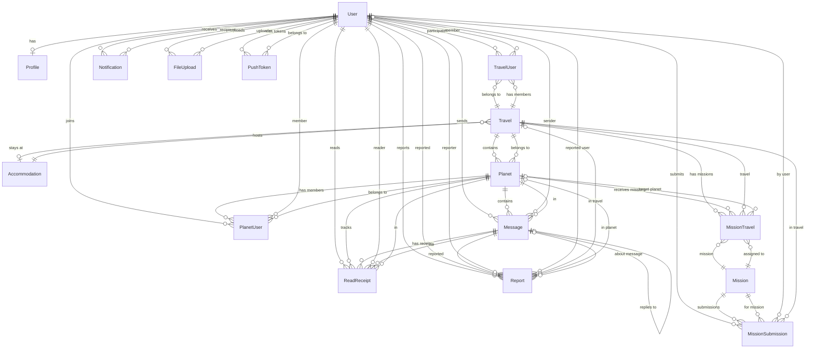
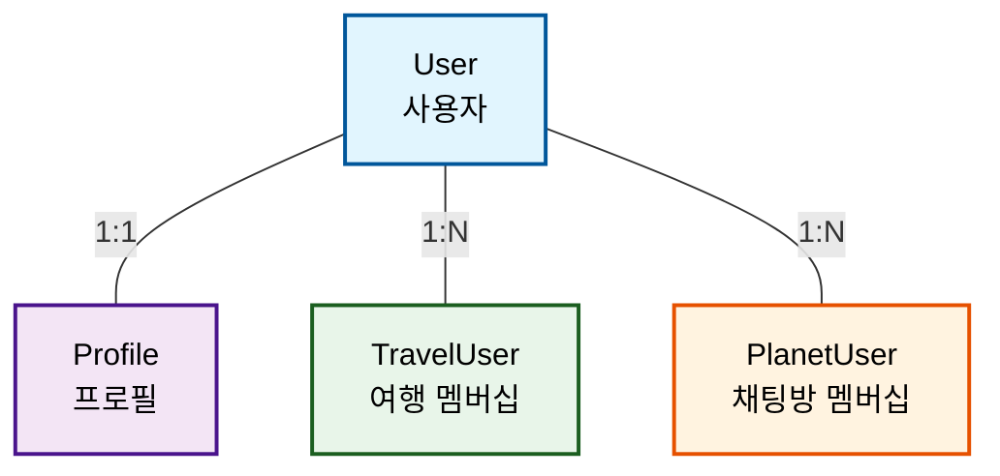
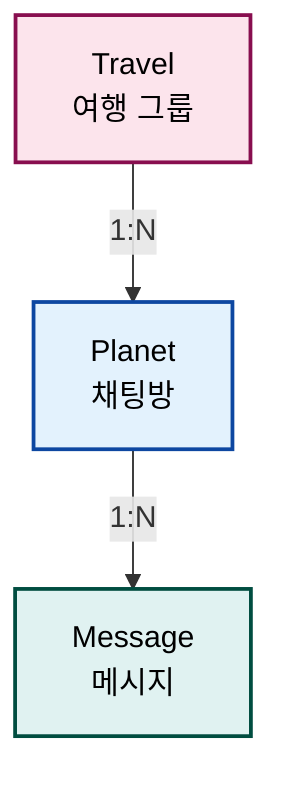
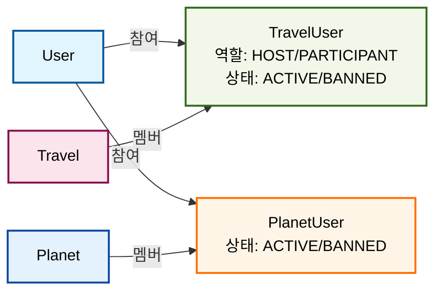
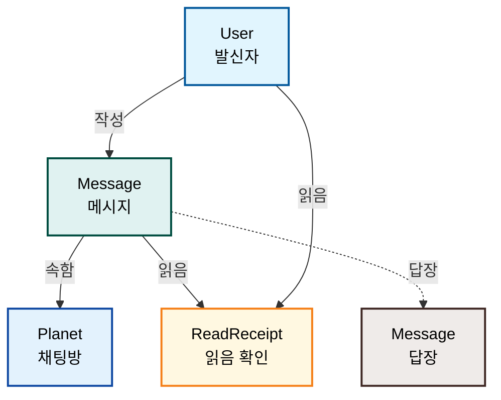
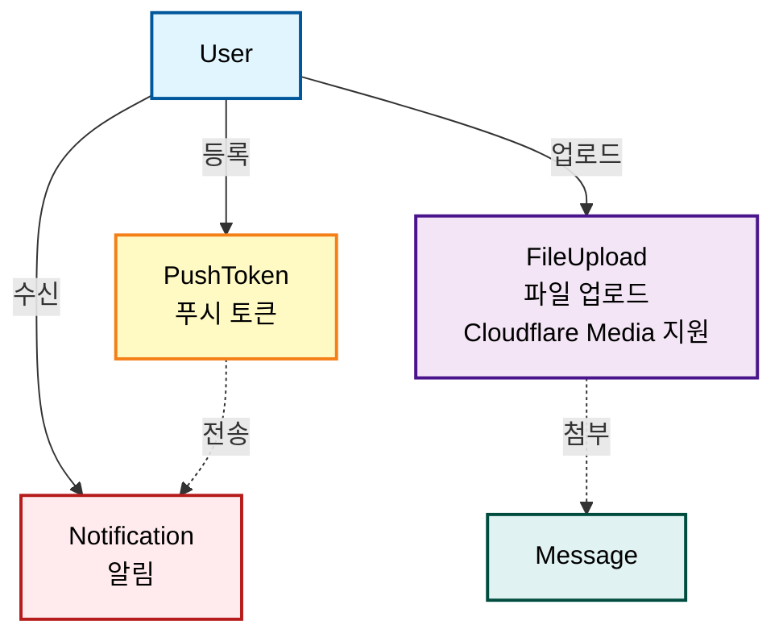
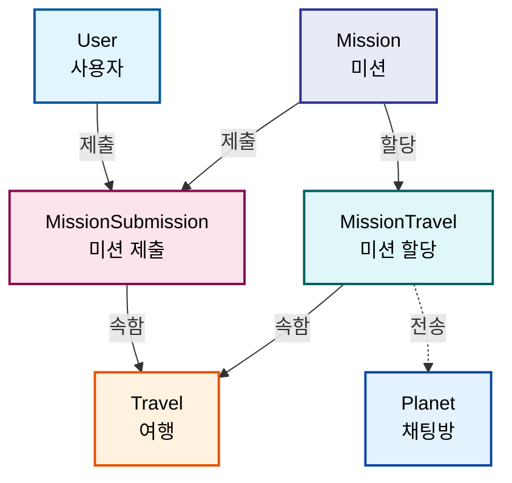
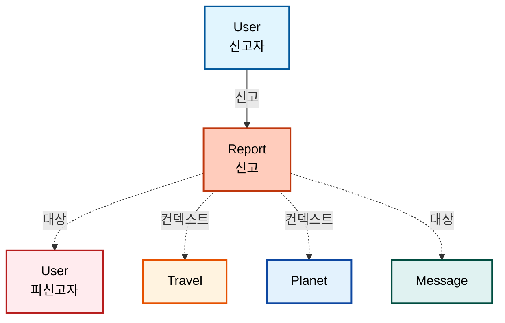

# 엔티티 관계도 (Entity Relationship Diagram)

> 최종 업데이트: 2025-08-21

## 전체 ERD

## 핵심 관계 설명

### 1. 사용자 관련 (User-centric)

### 2. 여행-채팅방 계층 구조 (Travel-Planet Hierarchy)

### 3. 멤버십 관계 (Membership Relations)

### 4. 메시지 시스템 (Message System)

### 5. 알림 및 파일 시스템 (Notification & File System)

### 6. 미션 시스템 (Mission System)

### 7. 신고 시스템 (Report System)

### 8. 숙박 시설 관계 (Accommodation Relations)

## 엔티티 상세 구조

### User (사용자)
| 필드명 | 타입 | 설명 | 제약조건 |
|--------|------|------|----------|
| id | int | Primary Key | PK, Auto Increment |
| socialId | string | 소셜 로그인 ID (ADMIN은 null) | Nullable, Index |
| provider | enum | 소셜 제공자 (GOOGLE/APPLE) | Nullable |
| name | string | 사용자 이름 | Not Null |
| email | string | 이메일 | Unique, Not Null |
| phone | string | 전화번호 | |
| role | enum | 사용자 역할 (ADMIN/HOST/USER) | Default: 'USER', Index |
| password | string | 비밀번호 (bcrypt, ADMIN 전용) | Nullable |
| notificationsEnabled | boolean | 알림 활성화 | Default: false |
| advertisingConsentEnabled | boolean | 광고 동의 | Default: false |
| isBanned | boolean | 차단 여부 | Default: false |
| bannedAt | timestamp | 차단 시작 시간 | Nullable |
| bannedReason | string | 차단 사유 | Nullable |
| bannedBy | int | 차단한 관리자 ID | FK → User.id, Nullable |
| bannedUntil | timestamp | 차단 해제 예정 시간 | Nullable |
| lastForcedLogout | timestamp | 마지막 강제 로그아웃 시간 | Nullable |
| sessionVersion | int | 세션 버전 | Default: 0 |
| refreshToken | string | Refresh Token | |
| socialMetadata | json | 소셜 로그인 추가 정보 | |
| createdAt | timestamp | 생성일시 | Not Null |
| updatedAt | timestamp | 수정일시 | Not Null |
| deletedAt | timestamp | 삭제일시 (Soft Delete) | |
| deletedBy | int | 삭제자 ID | FK → User.id |
| deletionReason | string | 삭제 사유 | |

**복합 유니크 인덱스**: (socialId, provider) WHERE socialId IS NOT NULL AND provider IS NOT NULL

### Profile (프로필)
| 필드명 | 타입 | 설명 | 제약조건 |
|--------|------|------|----------|
| id | int | Primary Key | PK, Auto Increment |
| userId | int | 사용자 ID | FK → User.id, Unique |
| nickname | string | 닉네임 | Not Null |
| name | string | 실제 이름 | Not Null |
| gender | enum | 성별 (MALE/FEMALE/OTHER/PREFER_NOT_TO_SAY) | |
| age | int | 나이 | Min: 1, Max: 150 |
| occupation | string | 직업 | |
| createdAt | timestamp | 생성일시 | Not Null |
| updatedAt | timestamp | 수정일시 | Not Null |

### Travel (여행 그룹)
| 필드명 | 타입 | 설명 | 제약조건 |
|--------|------|------|----------|
| id | int | Primary Key | PK, Auto Increment |
| name | string | 여행 이름 | Not Null, Max Length: 100 |
| description | text | 여행 설명 | |
| imageUrl | text | 여행 이미지 URL | |
| status | enum | 상태 (INACTIVE/ACTIVE) | Default: 'INACTIVE' |
| startDate | timestamp | 여행 시작 예정 날짜 | |
| endDate | timestamp | 여행 종료 예정 날짜 (채팅 만료) | Not Null |
| visibility | enum | 공개 설정 (PUBLIC/INVITE_ONLY) | Default: 'PUBLIC' |
| inviteCode | string | 초대 코드 | Unique, Max Length: 20 |
| accommodationId | int | 숙박 시설 ID | FK → Accommodation.id, Nullable |
| createdAt | timestamp | 생성일시 | Not Null |
| updatedAt | timestamp | 수정일시 | Not Null |

### Planet (채팅방)
| 필드명 | 타입 | 설명 | 제약조건 |
|--------|------|------|----------|
| id | int | Primary Key | PK, Auto Increment |
| travelId | int | 여행 ID | FK → Travel.id, Not Null |
| name | string | 채팅방 이름 | Not Null, Max Length: 100 |
| description | text | 채팅방 설명 | |
| imageUrl | text | 이미지 URL | |
| type | enum | 타입 (GROUP/DIRECT/ANNOUNCEMENT) | Not Null |
| status | enum | 상태 (ACTIVE/INACTIVE) | Default: 'ACTIVE' |
| timeRestriction | json | 시간 제한 설정 | |
| createdAt | timestamp | 생성일시 | Not Null |
| updatedAt | timestamp | 수정일시 | Not Null |

### Message (메시지)
| 필드명 | 타입 | 설명 | 제약조건 |
|--------|------|------|----------|
| id | int | Primary Key | PK, Auto Increment |
| planetId | int | 채팅방 ID | FK → Planet.id, Not Null |
| senderId | int | 발신자 ID | FK → User.id, Nullable |
| type | enum | 타입 (TEXT/IMAGE/VIDEO/FILE/SYSTEM) | Not Null |
| content | text | 메시지 내용 | Max Length: 10000 |
| fileMetadata | json | 파일 메타데이터 | |
| systemMetadata | json | 시스템 메타데이터 | |
| replyToMessageId | int | 답장 대상 메시지 ID | FK → Message.id |
| isEdited | boolean | 편집 여부 | Default: false |
| editedAt | timestamp | 편집일시 | |
| originalContent | text | 원본 내용 | |
| searchableText | text | 검색용 텍스트 | |
| reactions | json | 메시지 반응 정보 | |
| firstReadAt | timestamp | 첫 읽음 시간 | |
| isFromDeletedUser | boolean | 탈퇴한 사용자 메시지 여부 | Default: false |
| deletedUserType | string | 탈퇴한 사용자 타입 (user/admin) | Max Length: 20 |
| metadata | json | 메타데이터 | |
| status | enum | 상태 (SENT/DELIVERED/READ/FAILED/DELETED) | Default: 'SENT' |
| createdAt | timestamp | 생성일시 | Not Null |
| updatedAt | timestamp | 수정일시 | Not Null |
| deletedAt | timestamp | 삭제일시 (Soft Delete) | |
| deletedBy | int | 삭제자 ID | FK → User.id |
| deletionReason | string | 삭제 사유 | Max Length: 255 |

### TravelUser (여행 멤버십)
| 필드명 | 타입 | 설명 | 제약조건 |
|--------|------|------|----------|
| id | int | Primary Key | PK, Auto Increment |
| travelId | int | 여행 ID | FK → Travel.id, Not Null |
| userId | int | 사용자 ID | FK → User.id, Not Null |
| role | enum | 역할 (HOST/PARTICIPANT) | Default: 'PARTICIPANT' |
| status | enum | 상태 (ACTIVE/BANNED) | Default: 'ACTIVE' |
| joinedAt | timestamp | 가입 날짜 | Default: CURRENT_TIMESTAMP |
| isBanned | boolean | 정지 여부 | Default: false |
| bannedAt | timestamp | 정지 시작 시간 | |
| banReason | text | 정지 사유 | |
| createdAt | timestamp | 레코드 생성 시간 | Not Null |
| updatedAt | timestamp | 레코드 수정 시간 | Not Null |

**복합 유니크 인덱스**: (travelId, userId)

### PlanetUser (채팅방 멤버십)
| 필드명 | 타입 | 설명 | 제약조건 |
|--------|------|------|----------|
| id | int | Primary Key | PK, Auto Increment |
| planetId | int | 채팅방 ID | FK → Planet.id, Not Null |
| userId | int | 사용자 ID | FK → User.id, Nullable |
| isDeletedUser | boolean | 탈퇴한 사용자 기록 여부 | Default: false |
| status | enum | 상태 (ACTIVE/BANNED) | Default: 'ACTIVE' |
| joinedAt | timestamp | 참여일시 | Default: CURRENT_TIMESTAMP |
| notificationsEnabled | boolean | 알림 활성화 여부 | Default: true |
| createdAt | timestamp | 생성일시 | Not Null |
| updatedAt | timestamp | 수정일시 | Not Null |

**복합 유니크 인덱스**: (planetId, userId)

### ReadReceipt (메시지 읽음 확인)
| 필드명 | 타입 | 설명 | 제약조건 |
|--------|------|------|----------|
| id | int | Primary Key | PK, Auto Increment |
| messageId | int | 메시지 ID | FK → Message.id, Not Null |
| userId | int | 사용자 ID | FK → User.id, Not Null |
| planetId | int | 채팅방 ID | FK → Planet.id, Not Null |
| isRead | boolean | 읽음 여부 | Default: true |
| readAt | timestamp | 읽은 시간 | Default: CURRENT_TIMESTAMP |
| deviceType | string | 읽은 디바이스 타입 | Max Length: 50 |
| userAgent | string | User Agent | Max Length: 500 |
| metadata | json | 추가 읽음 메타데이터 | |
| createdAt | timestamp | 생성일시 | Not Null |
| updatedAt | timestamp | 수정일시 | Not Null |

**복합 유니크 인덱스**: (messageId, userId)

**추가 복합 인덱스**:
- (planetId, userId): Planet 내 사용자별 읽음 상태
- (planetId, isRead): Planet 내 읽음 상태별 조회
- (messageId, isRead): 메시지별 읽음 상태
- (userId, isRead): 사용자별 읽음 상태
- (planetId, userId, readAt): Planet 내 사용자별 시간순 조회
- (planetId, messageId, userId): 트리플 인덱스 (고성능 조회)

**메타데이터 구조 (metadata JSON)**:
- readSource: 읽음 처리 방식 (auto/manual/scroll)
- readDuration: 읽는데 걸린 시간 (ms)
- scrollPosition: 스크롤 위치
- viewportSize: 뷰포트 크기 (width, height)
- location: 위치 정보 (latitude, longitude, address)
- sessionId: 세션 ID
- clientMessageId: 클라이언트 메시지 ID
- batchReadCount: 일괄 읽음 처리된 메시지 수

### Notification (알림)
| 필드명 | 타입 | 설명 | 제약조건 |
|--------|------|------|----------|
| id | int | Primary Key | PK, Auto Increment |
| userId | int | 알림 받을 사용자 ID | FK → User.id, Not Null, Index |
| type | enum | 알림 타입 | NotificationType enum, Not Null, Index |
| title | string | 알림 제목 | Not Null, Max Length: 100 |
| content | text | 알림 내용 | Not Null |
| priority | enum | 알림 우선순위 | NotificationPriority enum, Default: 'NORMAL', Index |
| status | enum | 알림 상태 | NotificationStatus enum, Default: 'PENDING', Index |
| travelId | int | 관련 Travel ID | FK → Travel.id, Index |
| planetId | int | 관련 Planet ID | FK → Planet.id, Index |
| messageId | int | 관련 메시지 ID | |
| triggeredBy | int | 알림 발생시킨 사용자 ID | FK → User.id |
| channels | json | 전송할 채널 목록 | NotificationChannel[] |
| scheduledAt | timestamp | 예약 전송 시간 | Index |
| expiresAt | timestamp | 알림 만료 시간 | |
| data | json | 알림 관련 추가 데이터 | 메시지, Travel, Planet, 액션, 푸시 알림 관련 데이터 |
| createdAt | timestamp | 알림 생성 시간 | Not Null, Index |
| updatedAt | timestamp | 알림 정보 수정 시간 | Not Null |

**복합 인덱스**:
- (userId, status): 사용자별 상태 필터링
- (userId, type, createdAt): 사용자별 타입별 시간순
- (status, scheduledAt): 예약된 대기 알림
- (travelId, type): Travel별 알림 타입
- (planetId, type): Planet별 알림 타입

**NotificationType (알림 타입) - 단순화된 5가지 핵심 타입**:

- `MESSAGE`: 새로운 메시지를 받았을 때 (일반 채팅 메시지)
- `MENTION`: 메시지에서 @멘션을 받았을 때 (높은 우선순위)
- `REPLY`: 자신의 메시지에 답글이 달렸을 때
- `BANNED`: 사용자가 차단되었을 때 (관리자 액션)
- `SYSTEM`: 시스템 공지사항, 점검, 업데이트 등

**NotificationPriority (알림 우선순위)**:
- LOW: 낮음
- NORMAL: 보통 (기본값)
- HIGH: 높음
- URGENT: 긴급

**NotificationStatus (알림 상태) - 자동 업데이트만**:
- PENDING: 대기 중 (기본값)
- SENT: 전송됨
- DELIVERED: 배달됨
- FAILED: 실패

**NotificationChannel (알림 채널)**:
- IN_APP: 인앱 알림
- PUSH: 푸시 알림
- EMAIL: 이메일
- SMS: SMS (미래 확장)
- WEBSOCKET: WebSocket 실시간 알림

**data JSON 필드 구조**:
- **메시지 관련**: messageContent, messageType, senderName, senderAvatar
- **Travel 관련**: travelName, travelDescription, endDate
- **Planet 관련**: planetName, planetType
- **액션 관련**: actionUrl, actionText, actionData
- **푸시 알림 관련**: badge, sound, category, icon, image
- **사용자 정의**: customData
- **시스템 정보**: createdBy, batchId, channel (시스템에서 자동 추가)

### Admin (관리자 기능)
**참고**: Admin은 별도 엔티티가 아닌 User 엔티티의 role='ADMIN'으로 구현됨

**주요 기능** (AdminController에서 제공):
- 강제 로그아웃 실행
- 사용자 차단/해제
- 세션 관리 및 모니터링
- 토큰 블랙리스트 관리
- WebSocket 연결 강제 종료

### FileUpload (파일 업로드)
| 필드명 | 타입 | 설명 | 제약조건 |
|--------|------|------|----------|
| id | int | Primary Key | PK, Auto Increment |
| userId | int | 업로드한 사용자 ID | FK → User.id, Nullable, Index |
| isFromDeletedUser | boolean | 탈퇴한 사용자의 파일 여부 | Default: false, Index |
| originalFileName | string | 원본 파일명 | Not Null, Max Length: 255 |
| storageKey | string | 스토리지 키 (경로) | Not Null, Max Length: 500, Index |
| mimeType | string | 파일 MIME 타입 | Not Null, Max Length: 100 |
| fileSize | bigint | 파일 크기 (bytes) | Not Null |
| uploadType | enum | 업로드 타입 | FileUploadType enum, Default: 'DIRECT', Index |
| status | enum | 업로드 상태 | FileUploadStatus enum, Default: 'PENDING', Index |
| folder | string | 스토리지 폴더 경로 | Max Length: 255 |
| publicUrl | text | 공개 접근 URL | |
| thumbnailUrl | text | 썸네일 URL (이미지/비디오) | |
| cloudflareMediaId | string | Cloudflare Media ID | Max Length: 100 |
| mediaStorage | enum | 미디어 저장 위치 | 'r2'/'stream'/'images', Default: 'r2' |
| mediaVariants | json | 미디어 변형 URLs | 이미지 variants, 비디오 스트리밍 URLs |
| metadata | json | 추가 메타데이터 | |
| startedAt | timestamp | 업로드 시작 시간 | |
| completedAt | timestamp | 업로드 완료 시간 | |
| errorMessage | text | 에러 메시지 | |
| createdAt | timestamp | 생성일시 | Not Null |
| updatedAt | timestamp | 수정일시 | Not Null |

**FileUploadType (업로드 타입)**:
- `DIRECT`: Presigned URL 방식 (기본값)

**FileUploadStatus (업로드 상태)**:
- `PENDING`: 업로드 대기
- `COMPLETED`: 완료
- `FAILED`: 실패

**MediaStorage (미디어 저장 위치)**:
- `r2`: Cloudflare R2 (기본값, 모든 파일 타입)
- `stream`: Cloudflare Stream (비디오 최적화)
- `images`: Cloudflare Images (이미지 최적화)

**복합 인덱스**:
- (userId, status): 사용자별 상태 조회 최적화
- (status, createdAt): 상태별 시간순 조회

### PushToken (푸시 토큰)
| 필드명 | 타입 | 설명 | 제약조건 |
|--------|------|------|----------|
| id | int | Primary Key | PK, Auto Increment |
| userId | int | 사용자 ID | FK → User.id, Not Null |
| token | string | FCM/APNS 토큰 | Not Null, Max Length: 500 |
| platform | enum | 플랫폼 | PushTokenPlatform (ios/android/web), Not Null |
| deviceId | string | 디바이스 ID | Not Null, Max Length: 255 |
| deviceName | string | 디바이스 이름 | Max Length: 255 |
| isActive | boolean | 활성화 여부 | Default: true |
| failureCount | int | 전송 실패 횟수 | Default: 0 |
| lastUsedAt | timestamp | 마지막 사용 시간 | |
| createdAt | timestamp | 생성일시 | Not Null |
| updatedAt | timestamp | 수정일시 | Not Null |

**복합 유니크 인덱스**: (userId, deviceId)

### Report (신고)
| 필드명 | 타입 | 설명 | 제약조건 |
|--------|------|------|----------|
| id | int | Primary Key | PK, Auto Increment |
| reporterId | int | 신고자 ID | FK → User.id, Not Null |
| reportedUserId | int | 피신고자 ID | FK → User.id, Nullable |
| type | enum | 신고 유형 | ReportType enum, Not Null |
| reason | text | 신고 사유 | Not Null |
| status | enum | 처리 상태 | ReportStatus enum, Default: 'PENDING' |
| context | enum | 신고 컨텍스트 | ReportContext enum, Not Null |
| travelId | int | 관련 여행 ID | FK → Travel.id, Nullable |
| planetId | int | 관련 채팅방 ID | FK → Planet.id, Nullable |
| messageId | int | 관련 메시지 ID | FK → Message.id, Nullable |
| processedAt | timestamp | 처리 시간 | |
| processedBy | int | 처리자 ID | FK → User.id, Nullable |
| processingNote | text | 처리 메모 | |
| createdAt | timestamp | 생성일시 | Not Null |
| updatedAt | timestamp | 수정일시 | Not Null |

**ReportType (신고 유형)**:
- SPAM: 스팸
- HARASSMENT: 괴롭힘/따돌림
- INAPPROPRIATE_CONTENT: 부적절한 콘텐츠
- VIOLENCE: 폭력적인 내용
- HATE_SPEECH: 혐오 발언
- FRAUD: 사기/사칭
- PRIVACY_VIOLATION: 개인정보 침해
- OTHER: 기타

**ReportStatus (처리 상태)**:
- PENDING: 검토 대기
- REVIEWING: 검토 중
- RESOLVED: 처리 완료
- REJECTED: 반려

**ReportContext (신고 컨텍스트)**:
- TRAVEL: Travel 내에서 발생
- PLANET: Planet 내에서 발생
- MESSAGE: 특정 메시지 신고
- USER_PROFILE: 사용자 프로필 신고

### Accommodation (숙박 시설)
| 필드명 | 타입 | 설명 | 제약조건 |
|--------|------|------|----------|
| id | int | Primary Key | PK, Auto Increment |
| name | string | 숙소명 | Not Null, Max Length: 255 |
| description | text | 숙소 설명 | Nullable |
| createdAt | timestamp | 생성일시 | Not Null |
| updatedAt | timestamp | 수정일시 | Not Null |

### Mission (미션)
| 필드명 | 타입 | 설명 | 제약조건 |
|--------|------|------|----------|
| id | int | Primary Key | PK, Auto Increment |
| type | enum | 미션 타입 | MissionType enum, Not Null |
| target | enum | 미션 대상 | MissionTarget enum, Not Null |
| title | string | 미션 제목 | Not Null, Max Length: 200 |
| description | text | 미션 설명 | Not Null |
| metadata | jsonb | 미션 타입별 추가 데이터 | Nullable |
| startAt | timestamp | 미션 시작 시간 | Not Null |
| endAt | timestamp | 미션 종료 시간 | Not Null |
| active | boolean | 활성화 여부 | Default: true |
| maxSubmissions | int | 최대 제출 횟수 | Nullable (null = 무제한) |
| allowResubmission | boolean | 반복 제출 가능 여부 | Default: false |
| createdAt | timestamp | 생성일시 | Not Null |
| updatedAt | timestamp | 수정일시 | Not Null |

**MissionType (미션 타입)**:
- IMAGE: 이미지 미션
- VIDEO: 비디오 미션
- BALANCE_GAME: 밸런스 게임

**MissionTarget (미션 대상)**:
- INDIVIDUAL: 개인 미션
- GROUP: 단체 미션

### MissionTravel (미션-여행 할당)
| 필드명 | 타입 | 설명 | 제약조건 |
|--------|------|------|----------|
| id | int | Primary Key | PK, Auto Increment |
| missionId | int | 미션 ID | FK → Mission.id, Not Null |
| travelId | int | 여행 ID | FK → Travel.id, Not Null |
| planetId | int | 미션 전송 대상 채팅방 ID | FK → Planet.id, Nullable |
| assignedBy | int | 미션 할당한 관리자/호스트 ID | FK → User.id, Nullable |
| active | boolean | 미션 활성화 여부 | Default: true |
| submissionCount | int | 현재 제출 횟수 | Default: 0 |
| createdAt | timestamp | 생성일시 | Not Null |
| updatedAt | timestamp | 수정일시 | Not Null |

**복합 유니크 인덱스**: (missionId, travelId)
**인덱스**: (travelId), (missionId)

### MissionSubmission (미션 제출)
| 필드명 | 타입 | 설명 | 제약조건 |
|--------|------|------|----------|
| id | int | Primary Key | PK, Auto Increment |
| missionId | int | 미션 ID | FK → Mission.id, Not Null |
| userId | int | 제출한 사용자 ID | FK → User.id, Not Null |
| travelId | int | 여행 ID | FK → Travel.id, Not Null |
| submissionType | enum | 제출 타입 | MissionType enum, Not Null |
| content | jsonb | 제출 데이터 | Not Null |
| status | enum | 제출 상태 | SubmissionStatus enum, Default: 'PENDING' |
| reviewedBy | int | 평가한 관리자/호스트 ID | FK → User.id, Nullable |
| reviewedAt | timestamp | 평가 시간 | Nullable |
| reviewComment | text | 평가 코멘트 | Nullable |
| messageId | int | 연결된 메시지 ID | FK → Message.id, Nullable |
| createdAt | timestamp | 생성일시 | Not Null |
| updatedAt | timestamp | 수정일시 | Not Null |

**SubmissionStatus (제출 상태)**:
- PENDING: 검토 대기
- COMPLETED: 완료
- REJECTED: 거절

**인덱스**: (userId, missionId), (travelId, missionId), (status), (createdAt)

## 주요 특징

### 1. Soft Delete 지원 엔티티
- User, Message
- `deletedAt` 필드로 관리
- 데이터 보존 및 복구 가능
- Travel, Planet은 Soft Delete 미지원 (status로 관리)
- FileUpload은 하드 삭제 (익명화 처리만 지원)

### 2. Planet 타입 및 상태
- **타입 (type)**:
  - **GROUP**: 단체 채팅방 (그룹 멤버들간 대화)
  - **DIRECT**: 1:1 채팅방 (두 사용자간 개인 대화)
  - **ANNOUNCEMENT**: 공지사항 채팅방 (관리자만 메시지 작성 가능)
- **상태 (status)**:
  - **ACTIVE**: 활성 상태 (정상 사용 가능)
  - **INACTIVE**: 비활성 상태 (일시 중지)

### 3. Message 타입 및 상태
- **타입 (type)**:
  - **TEXT**: 텍스트 메시지
  - **IMAGE**: 이미지 파일
  - **VIDEO**: 비디오 파일
  - **FILE**: 일반 파일
  - **SYSTEM**: 시스템 메시지 (자동 생성)
- **상태 (status)**:
  - **SENT**: 전송됨
  - **DELIVERED**: 전달됨
  - **READ**: 읽음
  - **FAILED**: 전송 실패
  - **DELETED**: 삭제됨

### 4. 시간 기반 제한
- **TravelUser.bannedAt**: 정지 시작 시간 (isBanned 플래그와 함께 사용)
- **Planet.timeRestriction**: 채팅 가능 시간대
- **Message 편집**: 생성 후 15분 이내만 가능

### 5. 메타데이터 지원 (JSON 필드)
- Planet의 `timeRestriction`
- Message의 `metadata`, `fileMetadata`, `systemMetadata`, `reactions`
- FileUpload의 `metadata`, `mediaVariants` (Cloudflare Media 변형 URLs)
- Notification의 `data` (메시지, Travel, Planet, 액션, 푸시 알림, 시스템 정보 관련 데이터)
- ReadReceipt의 `metadata` (읽음 처리 방식, 위치 정보 등)
- User의 `socialMetadata`

## 데이터베이스 인덱스 전략

### 유니크 인덱스
- User: `email`, `(socialId, provider)` 복합 유니크 (조건부: WHERE socialId IS NOT NULL AND provider IS NOT NULL)
- Travel: `inviteCode`
- Profile: `userId` (1:1 관계)

### 복합 인덱스
- User: `(socialId, provider)` - 소셜 로그인 조회 (조건부 인덱스)
- User: `role` - 역할별 사용자 조회
- Travel: `(status, endDate)` - 상태별 만료일 조회
- Travel: `(visibility, status)` - 공개 설정별 상태 조회
- Planet: `(travelId, type)` - Travel 내 타입별 조회
- Planet: `(travelId, status)` - Travel 내 상태별 조회
- TravelUser: `(travelId, userId)` - 중복 방지
- TravelUser: `(travelId, status)` - Travel 내 활성 멤버 조회
- TravelUser: `(travelId, role)` - Travel 내 역할별 조회  
- TravelUser: `(userId, status)` - 사용자별 활성 Travel 조회
- TravelUser: `(status, joinedAt)` - 상태별 가입순 정렬
- PlanetUser: `(planetId, userId)` - 중복 방지
- PlanetUser: `(planetId, status)` - Planet 내 활성 멤버 조회
- ReadReceipt: `(messageId, userId)` - 중복 읽음 방지
- ReadReceipt: `(planetId, userId)` - Planet 내 사용자별 읽음 상태
- ReadReceipt: `(planetId, isRead)` - Planet 내 읽음 상태별 조회
- ReadReceipt: `(messageId, isRead)` - 메시지별 읽음 상태
- ReadReceipt: `(userId, isRead)` - 사용자별 읽음 상태
- ReadReceipt: `(planetId, userId, readAt)` - Planet 내 사용자별 시간순
- ReadReceipt: `(planetId, messageId, userId)` - 트리플 인덱스
- Message: `(planetId, createdAt)` - 메시지 목록 조회 최적화
- Notification: `(userId, status)` - 사용자별 상태 필터링
- Notification: `(userId, type, createdAt)` - 사용자별 타입별 시간순
- Notification: `(status, scheduledAt)` - 예약된 대기 알림
- Notification: `(travelId, type)` - Travel별 알림 타입
- Notification: `(planetId, type)` - Planet별 알림 타입

### 일반 인덱스
- Travel: `status`, `endDate`, `visibility`, `inviteCode`
- Planet: `type`, `travelId`, `status`
- TravelUser: `travelId`, `userId`, `role`, `status`, `joinedAt`
- PlanetUser: `planetId`, `userId`, `status`, `joinedAt`, `isDeletedUser`
- Message: `senderId`, `replyToMessageId`, `searchableText`
- ReadReceipt: `messageId`, `userId`, `planetId`, `isRead`, `readAt`
- Notification: `userId`, `type`, `priority`, `status`, `travelId`, `planetId`, `scheduledAt`, `createdAt`
- FileUpload: `userId`, `status`, `storageKey`, `uploadType`, `isFromDeletedUser`
- PushToken: `token`, `platform`, `userId`, `deviceId`
- Report: `reporterId`, `reportedUserId`, `status`, `context`, `travelId`, `planetId`, `messageId`
- Accommodation: `name`
- Mission: `type`, `target`, `active`, `startAt`, `endAt`
- MissionTravel: `missionId`, `travelId`, `planetId`
- MissionSubmission: `missionId`, `userId`, `travelId`, `status`, `createdAt`
- All entities: `createdAt`, `deletedAt`

## 관계 제약 조건

### CASCADE 동작
- User 삭제 시 → Profile Soft Delete
- Travel 삭제 시 → Planet Soft Delete
- Planet 삭제 시 → Message Soft Delete
- Message 삭제 시 → ReadReceipt 유지 (읽음 기록 보존)

### 제약 조건
- Message.type이 `SYSTEM`인 경우 → systemMetadata 필수
- TravelUser는 Travel당 User당 하나만 존재
- PlanetUser는 Planet당 User당 하나만 존재
- ReadReceipt는 Message당 User당 하나만 존재

## 성능 최적화 현황

### ✅ 구현 완료

#### 1. Lazy Loading 전략
- **모든 관계에 `eager: false` 설정**: 필요한 경우에만 관계 데이터 로드
- **@foryourdev/nestjs-crud의 `includes` 파라미터**: 명시적으로 필요한 관계만 포함
- **페이지네이션 자동 지원**: 모든 목록 조회 API에 적용

#### 2. Redis 캐싱 시스템
- **구현된 모듈**: `RedisModule`, `CacheModule`, `DistributedCacheService`
- **용도**: 세션 관리, 토큰 블랙리스트, 타이핑 인디케이터
- **WebSocket Redis Adapter**: 멀티 레플리카 환경에서 실시간 메시지 동기화

#### 3. 실시간 통신 최적화
- **Socket.io 구현**: WebSocket Gateway로 실시간 메시지 전송
- **Redis Adapter**: 여러 서버 인스턴스 간 WebSocket 이벤트 브로드캐스트
- **타이핑 인디케이터**: Redis 기반 실시간 타이핑 상태 관리

#### 4. 읽음 확인 일괄 처리
- **Bulk Create 지원**: nestjs-crud 네이티브 벌크 생성 활용
- **Batch Processing**: 여러 메시지를 한 번에 읽음 처리
- **메타데이터 추적**: `batchReadCount`로 일괄 처리 메시지 수 기록

#### 5. 파일 업로드 최적화
- **Direct Upload**: Presigned URL로 클라이언트 직접 업로드
- **서버 부하 감소**: 파일이 서버를 거치지 않고 R2로 직접 전송
- **대용량 파일 지원**: 최대 500MB 파일 처리

### ⏳ 부분 구현

#### 1. 검색 기능
- **searchableText 필드 존재**: Message 엔티티에 구현
- **GIN 인덱스 미적용**: PostgreSQL Full-text search 인덱스 설정 필요
- **검색 API 미구현**: 실제 검색 기능 개발 필요

### ❌ 미구현 (향후 개선사항)

#### 1. Eager Loading 최적화
- **현재 상태**: 모든 관계가 Lazy Loading으로 설정
- **개선 방안**: 자주 함께 조회되는 관계 (User-Profile 등) Eager Loading 고려

#### 2. Count 필드 최적화
- **필요 기능**: Message.readCount, Message.replyCount 동적 계산
- **구현 방법**: Virtual Column 또는 Computed Property 활용

#### 3. Cloudflare Media 고급 기능
- **현재**: R2 스토리지만 사용 중
- **향후 계획**:
  - Cloudflare Stream: 비디오 자동 인코딩 및 HLS 스트리밍
  - Cloudflare Images: 이미지 자동 리사이징 및 최적화
  - 미디어 변형 URLs 자동 생성

#### 4. 고급 캐싱 전략
- **Query Result 캐싱**: 자주 조회되는 데이터 Redis 캐싱
- **Entity 캐싱**: 변경이 적은 엔티티 (Travel, Planet) 캐싱
- **Cache Invalidation**: 데이터 변경 시 자동 캐시 무효화

#### 5. 데이터베이스 최적화
- **Connection Pooling**: 현재 기본 설정 사용 중
- **Query Optimization**: 복잡한 쿼리 최적화 필요
- **Partitioning**: 대용량 테이블 (Message, ReadReceipt) 파티셔닝 고려