# 엔티티 관계도 (Entity Relationship Diagram)

## 전체 ERD

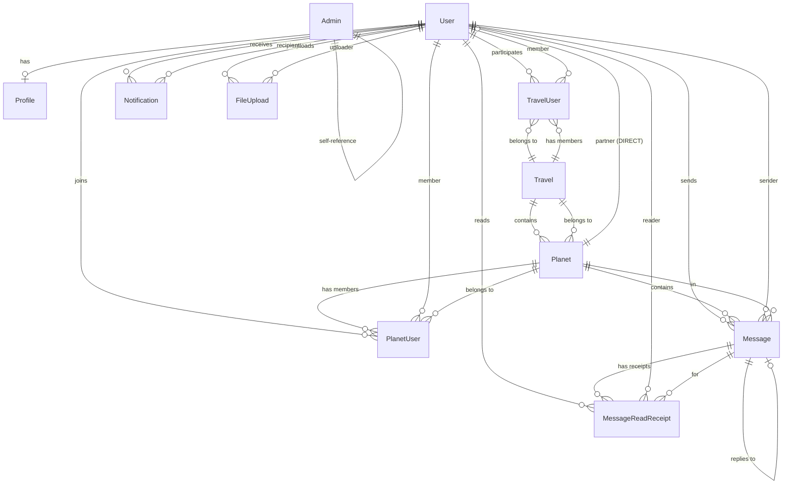

## 엔티티 상세 구조

### User (사용자)
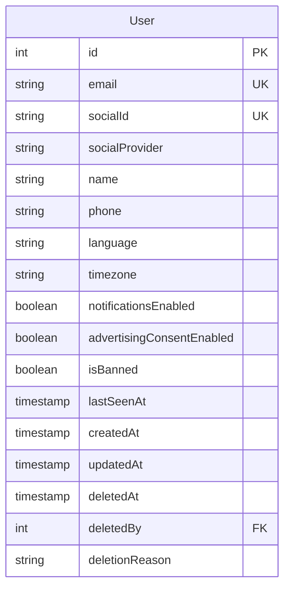

### Profile (프로필)
```mermaid
erDiagram
    Profile {
        int id PK
        int userId FK_UK
        string bio
        string profileImage
        string coverImage
        date birthday
        string gender
        json hobbies
        json interests
        string website
        json socialLinks
        json education
        json work
        json skills
        timestamp createdAt
        timestamp updatedAt
    }
```

### Travel (여행 그룹)
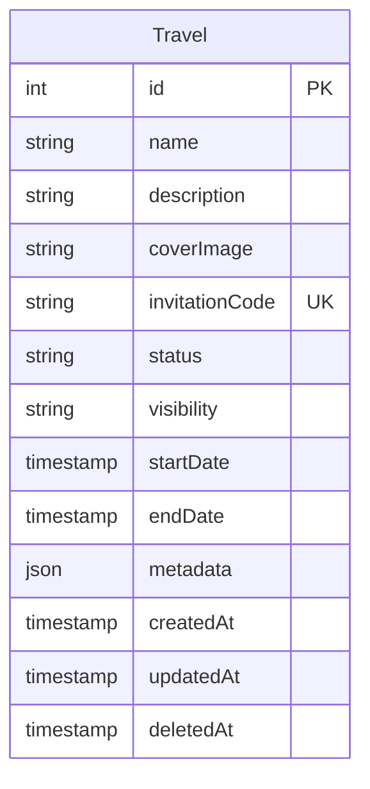

### Planet (채팅방)
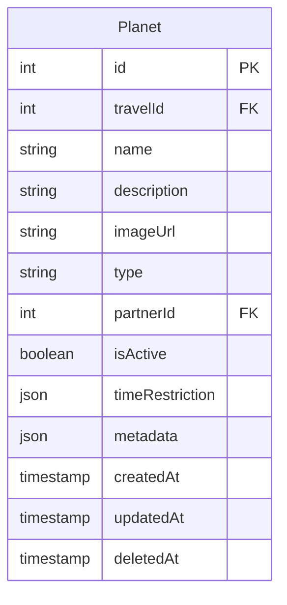

### Message (메시지)
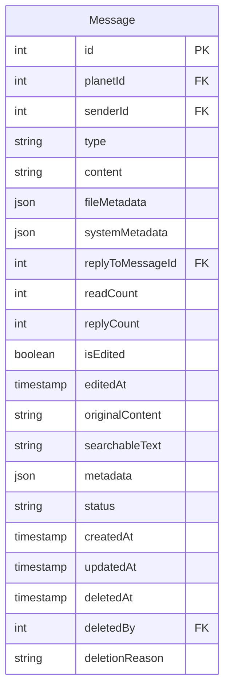

## 핵심 관계 설명

### 1. 사용자 관련 (User-centric)
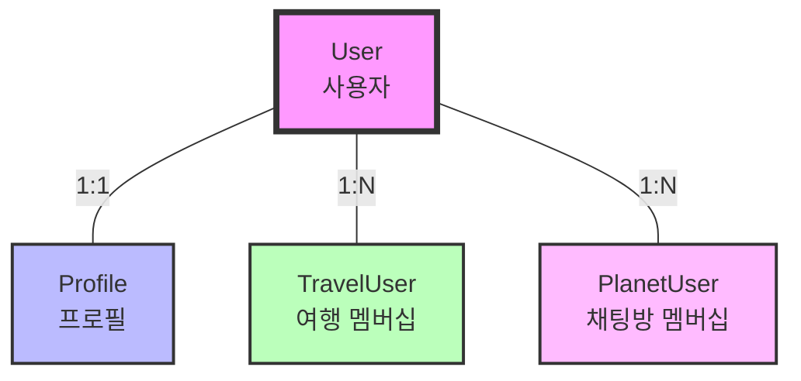

### 2. 여행-채팅방 계층 구조 (Travel-Planet Hierarchy)
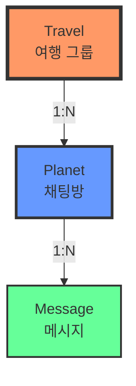

### 3. 멤버십 관계 (Membership Relations)
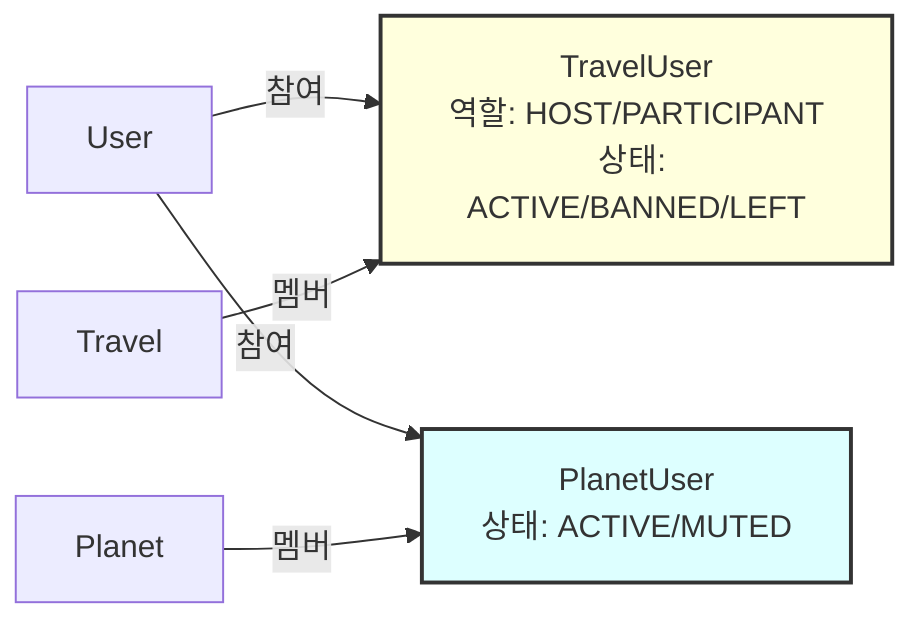

### 4. 메시지 시스템 (Message System)
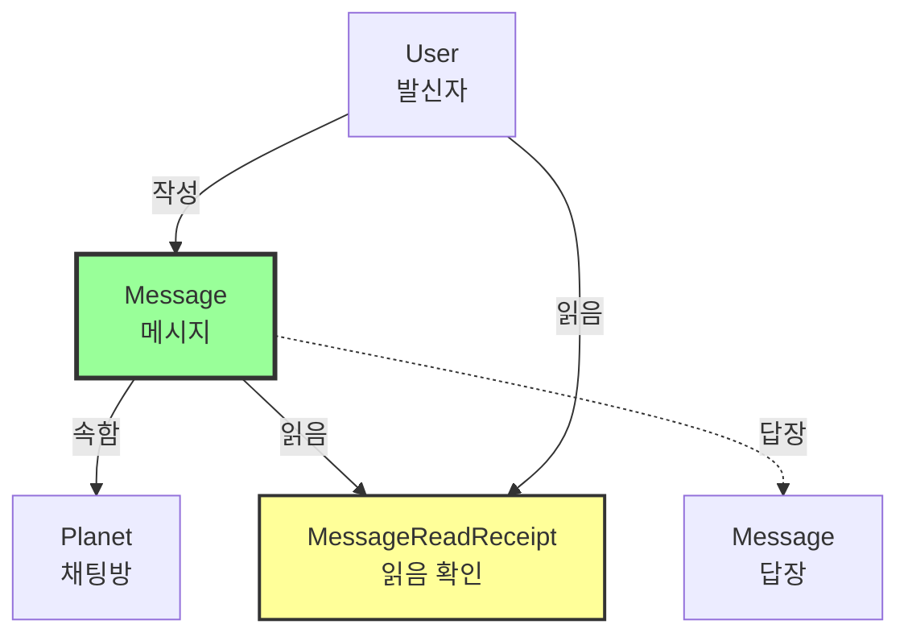

### 5. 알림 및 파일 시스템 (Notification & File System)
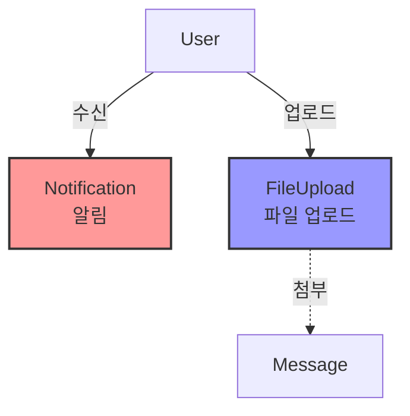

## 멤버십 엔티티 상세

### TravelUser (여행 멤버십)
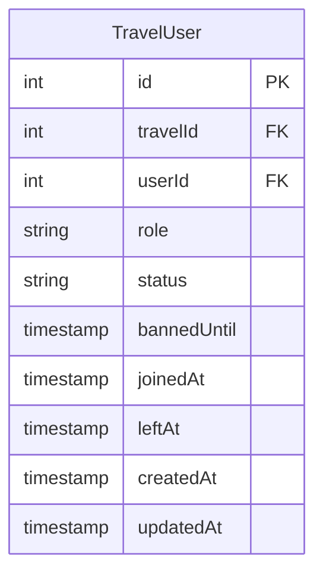

**역할 (Role)**
- `HOST`: 여행 관리자
- `PARTICIPANT`: 일반 참여자

**상태 (Status)**
- `ACTIVE`: 활성 멤버
- `BANNED`: 차단됨
- `LEFT`: 자진 탈퇴

### PlanetUser (채팅방 멤버십)
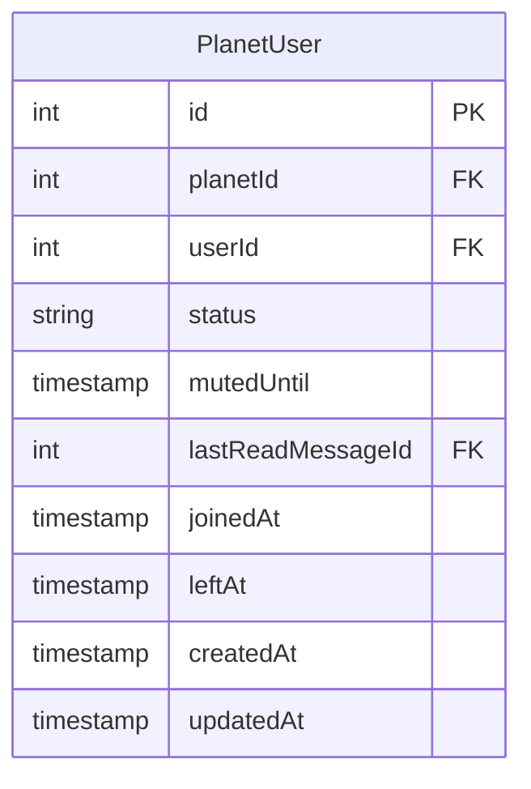

**상태 (Status)**
- `ACTIVE`: 활성 멤버
- `MUTED`: 음소거 상태

## 읽음 확인 및 알림 엔티티

### MessageReadReceipt (메시지 읽음 확인)
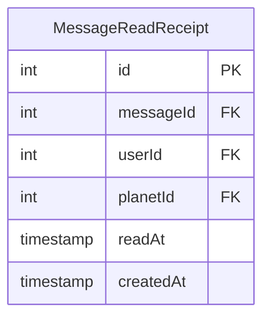

### Notification (알림)
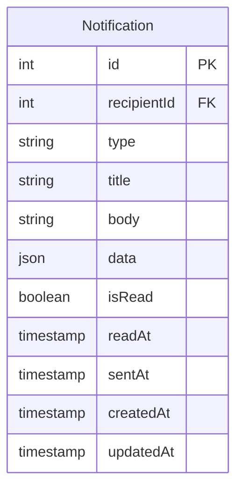

**알림 타입 (Type)**
- `MESSAGE`: 새 메시지
- `MESSAGE_REPLY`: 답장
- `TRAVEL_INVITATION`: 여행 초대
- `TRAVEL_UPDATE`: 여행 업데이트
- `PLANET_UPDATE`: 채팅방 업데이트
- `USER_JOINED`: 사용자 참여
- `USER_LEFT`: 사용자 탈퇴
- `MENTION`: 멘션
- `ANNOUNCEMENT`: 공지사항
- `SYSTEM`: 시스템 알림

## 파일 및 관리자 엔티티

### FileUpload (파일 업로드)
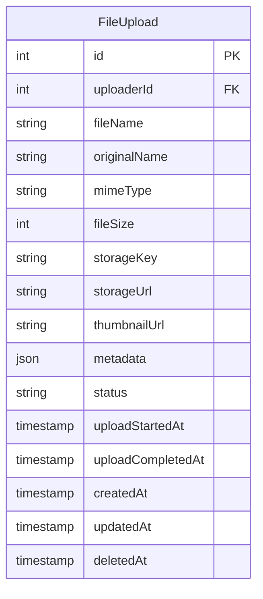

**상태 (Status)**
- `PENDING`: 대기 중
- `UPLOADING`: 업로드 중
- `COMPLETED`: 완료
- `FAILED`: 실패

### Admin (관리자)
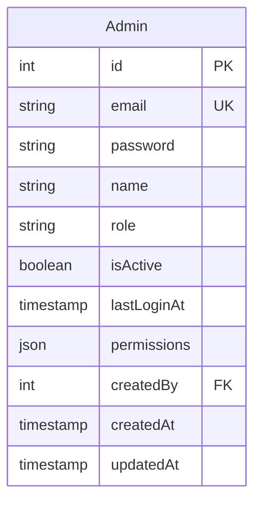

**역할 (Role)**
- `SUPER_ADMIN`: 최고 관리자
- `ADMIN`: 일반 관리자
- `MODERATOR`: 중재자

## 주요 특징

### 1. Soft Delete 지원 엔티티
- User, Travel, Planet, Message, FileUpload
- `deletedAt` 필드로 관리
- 데이터 보존 및 복구 가능

### 2. 시간 기반 제한
- **TravelUser.bannedUntil**: 차단 만료 시간
- **PlanetUser.mutedUntil**: 음소거 만료 시간
- **Planet.timeRestriction**: 채팅 가능 시간대
- **Message 편집**: 생성 후 15분 이내만 가능

### 3. 메타데이터 지원 (JSON 필드)
- Travel, Planet, Message, FileUpload의 `metadata`
- Profile의 `hobbies`, `interests`, `socialLinks`, `education`, `work`, `skills`
- Admin의 `permissions`
- Notification의 `data`

## 데이터베이스 인덱스 전략

### 유니크 인덱스
- User: `email`, `socialId`
- Travel: `invitationCode`
- Admin: `email`
- Profile: `userId` (1:1 관계)

### 복합 인덱스
- TravelUser: `(travelId, userId)` - 중복 방지
- PlanetUser: `(planetId, userId)` - 중복 방지
- MessageReadReceipt: `(messageId, userId)` - 중복 읽음 방지
- Message: `(planetId, createdAt)` - 메시지 목록 조회 최적화

### 일반 인덱스
- Message: `senderId`, `replyToMessageId`, `searchableText`
- Notification: `recipientId`, `isRead`, `type`
- FileUpload: `uploaderId`, `status`
- All entities: `createdAt`, `deletedAt`

## 관계 제약 조건

### CASCADE 동작
- User 삭제 시 → Profile Soft Delete
- Travel 삭제 시 → Planet Soft Delete
- Planet 삭제 시 → Message Soft Delete
- Message 삭제 시 → MessageReadReceipt 유지 (읽음 기록 보존)

### 제약 조건
- Planet.type이 `DIRECT`인 경우 → partnerId 필수
- Message.type이 `SYSTEM`인 경우 → systemMetadata 필수
- TravelUser는 Travel당 User당 하나만 존재
- PlanetUser는 Planet당 User당 하나만 존재
- MessageReadReceipt는 Message당 User당 하나만 존재

## 성능 최적화 고려사항

### 1. Eager Loading 관계
- User → Profile (자주 함께 조회)
- Message → Sender (메시지 목록 표시 시)
- TravelUser → User (멤버 목록 표시 시)

### 2. Lazy Loading 관계
- Travel → Planets (필요시에만 로드)
- Planet → Messages (페이지네이션 적용)
- User → Notifications (페이지네이션 적용)

### 3. Count 필드 비정규화
- Message.readCount: 읽은 사용자 수 (캐싱)
- Message.replyCount: 답장 수 (캐싱)
- Travel.memberCount: 멤버 수 (캐싱 고려)
- Planet.memberCount: 멤버 수 (캐싱 고려)

### 4. 검색 최적화
- Message.searchableText: Full-text search 인덱스
- PostgreSQL의 GIN 인덱스 활용
- 검색 가능 필드: content, fileMetadata.originalName, systemMetadata.reason

### 5. 실시간 기능 최적화
- Redis를 활용한 온라인 상태 관리
- WebSocket을 통한 실시간 메시지 전송
- 읽음 확인 일괄 처리 (batch processing)