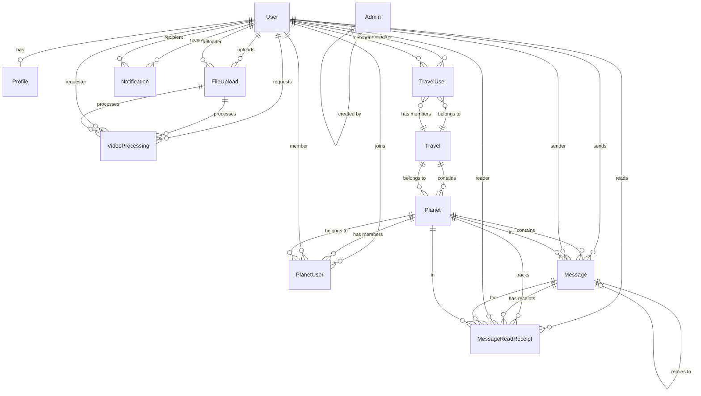
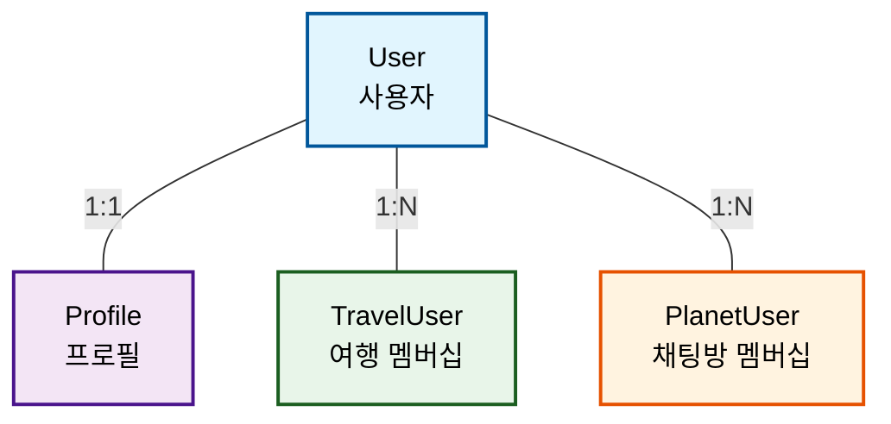
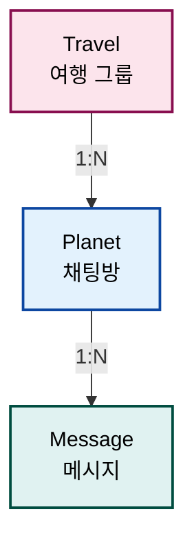
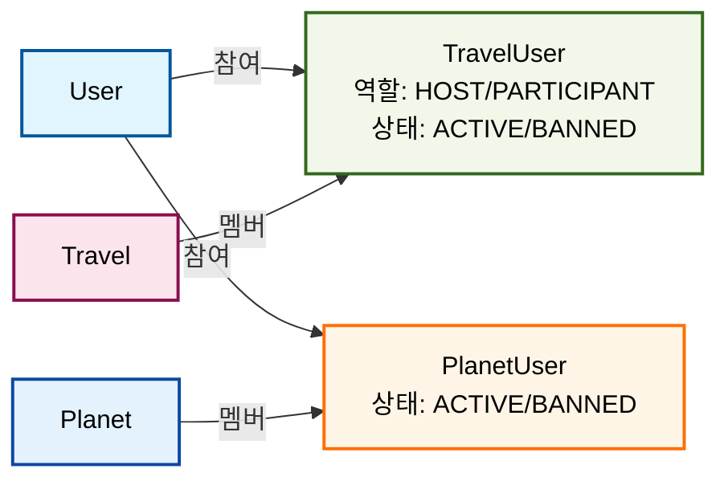
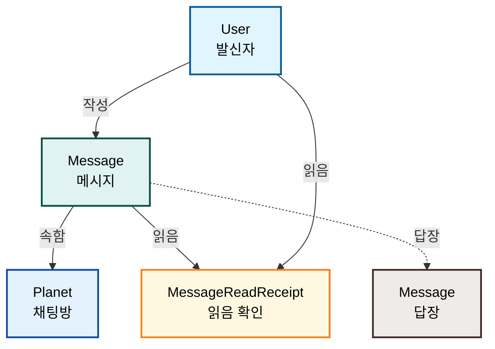
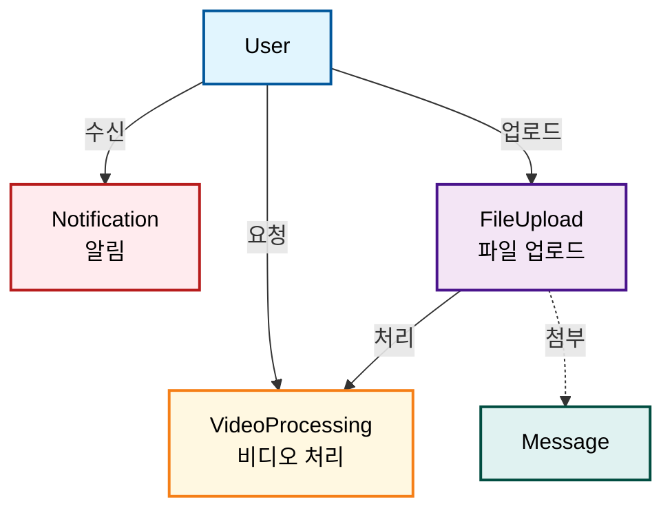

# 엔티티 관계도 (Entity Relationship Diagram)

## 전체 ERD

## 핵심 관계 설명

### 1. 사용자 관련 (User-centric)

### 2. 여행-채팅방 계층 구조 (Travel-Planet Hierarchy)

### 3. 멤버십 관계 (Membership Relations)

### 4. 메시지 시스템 (Message System)

### 5. 알림 및 파일 시스템 (Notification & File System)

## 엔티티 상세 구조

### User (사용자)
| 필드명 | 타입 | 설명 | 제약조건 |
|--------|------|------|----------|
| id | int | Primary Key | PK, Auto Increment |
| socialId | string | 소셜 로그인 ID | Not Null, Index |
| provider | enum | 소셜 제공자 (GOOGLE/APPLE) | Not Null |
| name | string | 사용자 이름 | Not Null |
| email | string | 이메일 | Unique, Not Null |
| phone | string | 전화번호 | |
| notificationsEnabled | boolean | 알림 활성화 | Default: false |
| advertisingConsentEnabled | boolean | 광고 동의 | Default: false |
| isBanned | boolean | 차단 여부 | Default: false |
| refreshToken | string | Refresh Token | |
| socialMetadata | json | 소셜 로그인 추가 정보 | |
| createdAt | timestamp | 생성일시 | Not Null |
| updatedAt | timestamp | 수정일시 | Not Null |
| deletedAt | timestamp | 삭제일시 (Soft Delete) | |
| deletedBy | int | 삭제자 ID | FK → User.id |
| deletionReason | string | 삭제 사유 | |

**복합 유니크 인덱스**: (socialId, provider)

### Profile (프로필)
| 필드명 | 타입 | 설명 | 제약조건 |
|--------|------|------|----------|
| id | int | Primary Key | PK, Auto Increment |
| userId | int | 사용자 ID | FK → User.id, Unique |
| nickname | string | 닉네임 | Not Null |
| name | string | 실제 이름 | Not Null |
| gender | enum | 성별 (MALE/FEMALE/OTHER/PREFER_NOT_TO_SAY) | |
| age | int | 나이 | Min: 1, Max: 150 |
| occupation | string | 직업 | |
| createdAt | timestamp | 생성일시 | Not Null |
| updatedAt | timestamp | 수정일시 | Not Null |

### Travel (여행 그룹)
| 필드명 | 타입 | 설명 | 제약조건 |
|--------|------|------|----------|
| id | int | Primary Key | PK, Auto Increment |
| name | string | 여행 이름 | Not Null, Max Length: 100 |
| description | text | 여행 설명 | |
| imageUrl | text | 여행 이미지 URL | |
| status | enum | 상태 (INACTIVE/ACTIVE) | Default: 'INACTIVE' |
| startDate | timestamp | 여행 시작 예정 날짜 | |
| endDate | timestamp | 여행 종료 예정 날짜 (채팅 만료) | Not Null |
| visibility | enum | 공개 설정 (PUBLIC/INVITE_ONLY) | Default: 'PUBLIC' |
| inviteCode | string | 초대 코드 | Unique, Max Length: 20 |
| createdAt | timestamp | 생성일시 | Not Null |
| updatedAt | timestamp | 수정일시 | Not Null |

### Planet (채팅방)
| 필드명 | 타입 | 설명 | 제약조건 |
|--------|------|------|----------|
| id | int | Primary Key | PK, Auto Increment |
| travelId | int | 여행 ID | FK → Travel.id, Not Null |
| name | string | 채팅방 이름 | Not Null, Max Length: 100 |
| description | text | 채팅방 설명 | |
| imageUrl | text | 이미지 URL | |
| type | enum | 타입 (GROUP/DIRECT/ANNOUNCEMENT) | Not Null |
| status | enum | 상태 (ACTIVE/INACTIVE) | Default: 'ACTIVE' |
| timeRestriction | json | 시간 제한 설정 | |
| createdAt | timestamp | 생성일시 | Not Null |
| updatedAt | timestamp | 수정일시 | Not Null |

### Message (메시지)
| 필드명 | 타입 | 설명 | 제약조건 |
|--------|------|------|----------|
| id | int | Primary Key | PK, Auto Increment |
| planetId | int | 채팅방 ID | FK → Planet.id, Not Null |
| senderId | int | 발신자 ID | FK → User.id, Nullable |
| type | enum | 타입 (TEXT/IMAGE/VIDEO/FILE/SYSTEM) | Not Null |
| content | text | 메시지 내용 | Max Length: 10000 |
| fileMetadata | json | 파일 메타데이터 | |
| systemMetadata | json | 시스템 메타데이터 | |
| replyToMessageId | int | 답장 대상 메시지 ID | FK → Message.id |
| isEdited | boolean | 편집 여부 | Default: false |
| editedAt | timestamp | 편집일시 | |
| originalContent | text | 원본 내용 | |
| searchableText | text | 검색용 텍스트 | |
| reactions | json | 메시지 반응 정보 | |
| firstReadAt | timestamp | 첫 읽음 시간 | |
| isFromDeletedUser | boolean | 탈퇴한 사용자 메시지 여부 | Default: false |
| deletedUserType | string | 탈퇴한 사용자 타입 (user/admin) | Max Length: 20 |
| metadata | json | 메타데이터 | |
| status | enum | 상태 (SENT/DELIVERED/READ/FAILED/DELETED) | Default: 'SENT' |
| createdAt | timestamp | 생성일시 | Not Null |
| updatedAt | timestamp | 수정일시 | Not Null |
| deletedAt | timestamp | 삭제일시 (Soft Delete) | |
| deletedBy | int | 삭제자 ID | FK → User.id |
| deletionReason | string | 삭제 사유 | Max Length: 255 |

### TravelUser (여행 멤버십)
| 필드명 | 타입 | 설명 | 제약조건 |
|--------|------|------|----------|
| id | int | Primary Key | PK, Auto Increment |
| travelId | int | 여행 ID | FK → Travel.id, Not Null |
| userId | int | 사용자 ID | FK → User.id, Not Null |
| role | enum | 역할 (HOST/PARTICIPANT) | Default: 'PARTICIPANT' |
| status | enum | 상태 (ACTIVE/BANNED) | Default: 'ACTIVE' |
| joinedAt | timestamp | 가입 날짜 | Default: CURRENT_TIMESTAMP |
| isBanned | boolean | 정지 여부 | Default: false |
| bannedAt | timestamp | 정지 시작 시간 | |
| banReason | text | 정지 사유 | |
| createdAt | timestamp | 레코드 생성 시간 | Not Null |
| updatedAt | timestamp | 레코드 수정 시간 | Not Null |

**복합 유니크 인덱스**: (travelId, userId)

### PlanetUser (채팅방 멤버십)
| 필드명 | 타입 | 설명 | 제약조건 |
|--------|------|------|----------|
| id | int | Primary Key | PK, Auto Increment |
| planetId | int | 채팅방 ID | FK → Planet.id, Not Null |
| userId | int | 사용자 ID | FK → User.id, Nullable |
| isDeletedUser | boolean | 탈퇴한 사용자 기록 여부 | Default: false |
| status | enum | 상태 (ACTIVE/BANNED) | Default: 'ACTIVE' |
| joinedAt | timestamp | 참여일시 | Default: CURRENT_TIMESTAMP |
| notificationsEnabled | boolean | 알림 활성화 여부 | Default: true |
| createdAt | timestamp | 생성일시 | Not Null |
| updatedAt | timestamp | 수정일시 | Not Null |

**복합 유니크 인덱스**: (planetId, userId)

### MessageReadReceipt (메시지 읽음 확인)
| 필드명 | 타입 | 설명 | 제약조건 |
|--------|------|------|----------|
| id | int | Primary Key | PK, Auto Increment |
| messageId | int | 메시지 ID | FK → Message.id, Not Null |
| userId | int | 사용자 ID | FK → User.id, Not Null |
| planetId | int | 채팅방 ID | FK → Planet.id, Not Null |
| isRead | boolean | 읽음 여부 | Default: true |
| readAt | timestamp | 읽은 시간 | Default: CURRENT_TIMESTAMP |
| deviceType | string | 읽은 디바이스 타입 | Max Length: 50 |
| userAgent | string | User Agent | Max Length: 500 |
| metadata | json | 추가 읽음 메타데이터 | |
| createdAt | timestamp | 생성일시 | Not Null |
| updatedAt | timestamp | 수정일시 | Not Null |

**복합 유니크 인덱스**: (messageId, userId)

**추가 복합 인덱스**:
- (planetId, userId): Planet 내 사용자별 읽음 상태
- (planetId, isRead): Planet 내 읽음 상태별 조회
- (messageId, isRead): 메시지별 읽음 상태
- (userId, isRead): 사용자별 읽음 상태
- (planetId, userId, readAt): Planet 내 사용자별 시간순 조회
- (planetId, messageId, userId): 트리플 인덱스 (고성능 조회)

**메타데이터 구조 (metadata JSON)**:
- readSource: 읽음 처리 방식 (auto/manual/scroll)
- readDuration: 읽는데 걸린 시간 (ms)
- scrollPosition: 스크롤 위치
- viewportSize: 뷰포트 크기 (width, height)
- location: 위치 정보 (latitude, longitude, address)
- sessionId: 세션 ID
- clientMessageId: 클라이언트 메시지 ID
- batchReadCount: 일괄 읽음 처리된 메시지 수

### Notification (알림)
| 필드명 | 타입 | 설명 | 제약조건 |
|--------|------|------|----------|
| id | int | Primary Key | PK, Auto Increment |
| userId | int | 알림 받을 사용자 ID | FK → User.id, Not Null, Index |
| type | enum | 알림 타입 | NotificationType enum, Not Null, Index |
| title | string | 알림 제목 | Not Null, Max Length: 100 |
| content | text | 알림 내용 | Not Null |
| priority | enum | 알림 우선순위 | NotificationPriority enum, Default: 'NORMAL', Index |
| status | enum | 알림 상태 | NotificationStatus enum, Default: 'PENDING', Index |
| isRead | boolean | 읽음 여부 | Default: false, Index |
| readAt | timestamp | 읽은 시간 | |
| travelId | int | 관련 Travel ID | FK → Travel.id, Index |
| planetId | int | 관련 Planet ID | FK → Planet.id, Index |
| messageId | int | 관련 메시지 ID | |
| triggeredBy | int | 알림 발생시킨 사용자 ID | FK → User.id |
| channels | json | 전송할 채널 목록 | NotificationChannel[] |
| scheduledAt | timestamp | 예약 전송 시간 | Index |
| expiresAt | timestamp | 알림 만료 시간 | |
| data | json | 알림 관련 추가 데이터 | 메시지, Travel, Planet, 액션, 푸시 알림 관련 데이터 |
| metadata | json | 알림 메타데이터 | 디바이스 타입, 앱 버전, 언어/지역, 시간대, 재시도 횟수 등 |
| createdAt | timestamp | 알림 생성 시간 | Not Null, Index |
| updatedAt | timestamp | 알림 정보 수정 시간 | Not Null |

**복합 인덱스**:
- (userId, isRead): 사용자별 읽지 않은 알림
- (userId, status): 사용자별 상태 필터링
- (userId, type, createdAt): 사용자별 타입별 시간순
- (status, scheduledAt): 예약된 대기 알림
- (travelId, type): Travel별 알림 타입
- (planetId, type): Planet별 알림 타입

**NotificationType (알림 타입) - 단순화된 5가지 핵심 타입**:

- `MESSAGE`: 새로운 메시지를 받았을 때 (일반 채팅 메시지)
- `MENTION`: 메시지에서 @멘션을 받았을 때 (높은 우선순위)
- `REPLY`: 자신의 메시지에 답글이 달렸을 때
- `BANNED`: 사용자가 차단되었을 때 (관리자 액션)
- `SYSTEM`: 시스템 공지사항, 점검, 업데이트 등

**NotificationPriority (알림 우선순위)**:
- LOW: 낮음
- NORMAL: 보통 (기본값)
- HIGH: 높음
- URGENT: 긴급

**NotificationStatus (알림 상태) - 자동 업데이트만**:
- PENDING: 대기 중 (기본값)
- SENT: 전송됨
- DELIVERED: 배달됨
- FAILED: 실패

**NotificationChannel (알림 채널)**:
- IN_APP: 인앱 알림
- PUSH: 푸시 알림
- EMAIL: 이메일
- SMS: SMS (미래 확장)
- WEBSOCKET: WebSocket 실시간 알림

**data JSON 필드 구조**:
- **메시지 관련**: messageContent, messageType, senderName, senderAvatar
- **Travel 관련**: travelName, travelDescription, endDate
- **Planet 관련**: planetName, planetType
- **액션 관련**: actionUrl, actionText, actionData
- **푸시 알림 관련**: badge, sound, category, icon, image
- **사용자 정의**: customData

**metadata JSON 필드 구조**:
- deviceType: 대상 디바이스 타입
- appVersion: 앱 버전
- locale: 언어/지역
- timezone: 시간대
- retryCount: 재시도 횟수
- batchId: 배치 ID (대량 전송시)
- tags: 분류 태그

### FileUpload (파일 업로드)
| 필드명 | 타입 | 설명 | 제약조건 |
|--------|------|------|----------|
| id | int | Primary Key | PK, Auto Increment |
| uploaderId | int | 업로더 ID | FK → User.id, Not Null |
| fileName | string | 파일명 | Not Null |
| originalName | string | 원본 파일명 | Not Null |
| mimeType | string | MIME 타입 | Not Null |
| fileSize | int | 파일 크기 (bytes) | Not Null |
| storageKey | string | 저장소 키 | Unique, Not Null |
| storageUrl | string | 저장소 URL | Not Null |
| thumbnailUrl | string | 썸네일 URL | |
| metadata | json | 메타데이터 | |
| status | enum | 상태 (PENDING/UPLOADING/COMPLETED/FAILED) | Default: 'PENDING' |
| uploadStartedAt | timestamp | 업로드 시작 시간 | |
| uploadCompletedAt | timestamp | 업로드 완료 시간 | |
| createdAt | timestamp | 생성일시 | Not Null |
| updatedAt | timestamp | 수정일시 | Not Null |
| deletedAt | timestamp | 삭제일시 (Soft Delete) | |

### Admin (관리자)
| 필드명 | 타입 | 설명 | 제약조건 |
|--------|------|------|----------|
| id | int | Primary Key | PK, Auto Increment |
| email | string | 이메일 | Unique, Not Null |
| password | string | 비밀번호 (bcrypt) | Not Null |
| name | string | 이름 | Not Null |
| role | enum | 역할 (SUPER_ADMIN/ADMIN/MODERATOR) | Not Null |
| isActive | boolean | 활성화 여부 | Default: true |
| lastLoginAt | timestamp | 마지막 로그인 시간 | |
| permissions | json | 권한 설정 | |
| createdBy | int | 생성자 ID | FK → Admin.id |
| createdAt | timestamp | 생성일시 | Not Null |
| updatedAt | timestamp | 수정일시 | Not Null |

### VideoProcessing (비디오 처리)
| 필드명 | 타입 | 설명 | 제약조건 |
|--------|------|------|----------|
| id | int | Primary Key | PK, Auto Increment |
| userId | int | 요청한 사용자 ID | FK → User.id |
| fileUploadId | int | 원본 파일 업로드 ID | FK → FileUpload.id |
| processingType | enum | 처리 타입 (COMPRESSION/THUMBNAIL/METADATA/PREVIEW/FULL_PROCESSING) | Not Null |
| status | enum | 처리 상태 (PENDING/PROCESSING/COMPLETED/FAILED/CANCELLED) | Default: 'PENDING' |
| qualityProfile | enum | 품질 프로필 (LOW/MEDIUM/HIGH/ULTRA) | |
| inputStorageKey | string | 원본 파일 스토리지 키 | Not Null |
| originalFileName | string | 원본 파일명 | Not Null |
| inputFileSize | bigint | 원본 파일 크기 (bytes) | Not Null |
| inputMimeType | string | 원본 MIME 타입 | Not Null |
| outputStorageKeys | text | 처리된 파일 키들 (JSON) | |
| outputTotalSize | bigint | 출력 파일들 총 크기 | |
| outputUrls | text | 출력 파일 URLs (JSON) | |
| progress | int | 진행률 (0-100) | Default: 0 |
| estimatedDurationSeconds | int | 예상 소요 시간 (초) | |
| actualDurationSeconds | int | 실제 소요 시간 (초) | |
| inputMetadata | json | 입력 파일 메타데이터 | |
| outputMetadata | json | 출력 파일 메타데이터 | |
| thumbnails | json | 썸네일 정보 | |
| errorMessage | text | 에러 메시지 | |
| processingLogs | json | 처리 로그 | |
| retryCount | int | 재시도 횟수 | Default: 0 |
| isFromDeletedUser | boolean | 탈퇴한 사용자 작업 여부 | Default: false |
| startedAt | timestamp | 처리 시작 시간 | |
| completedAt | timestamp | 처리 완료 시간 | |
| createdAt | timestamp | 생성일시 | Not Null |
| updatedAt | timestamp | 수정일시 | Not Null |

**처리 타입**:
- COMPRESSION: 비디오 압축
- THUMBNAIL: 썸네일 추출
- METADATA: 메타데이터 추출
- PREVIEW: 미리보기 생성
- FULL_PROCESSING: 전체 처리

## 주요 특징

### 1. Soft Delete 지원 엔티티
- User, Message, FileUpload
- `deletedAt` 필드로 관리
- 데이터 보존 및 복구 가능
- Travel, Planet은 Soft Delete 미지원 (status로 관리)
- VideoProcessing은 하드 삭제 (익명화 처리만 지원)

### 2. Planet 타입 및 상태
- **타입 (type)**:
  - **GROUP**: 단체 채팅방 (그룹 멤버들간 대화)
  - **DIRECT**: 1:1 채팅방 (두 사용자간 개인 대화)
  - **ANNOUNCEMENT**: 공지사항 채팅방 (관리자만 메시지 작성 가능)
- **상태 (status)**:
  - **ACTIVE**: 활성 상태 (정상 사용 가능)
  - **INACTIVE**: 비활성 상태 (일시 중지)

### 3. Message 타입 및 상태
- **타입 (type)**:
  - **TEXT**: 텍스트 메시지
  - **IMAGE**: 이미지 파일
  - **VIDEO**: 비디오 파일
  - **FILE**: 일반 파일
  - **SYSTEM**: 시스템 메시지 (자동 생성)
- **상태 (status)**:
  - **SENT**: 전송됨
  - **DELIVERED**: 전달됨
  - **READ**: 읽음
  - **FAILED**: 전송 실패
  - **DELETED**: 삭제됨

### 4. 시간 기반 제한
- **TravelUser.bannedAt**: 정지 시작 시간 (isBanned 플래그와 함께 사용)
- **Planet.timeRestriction**: 채팅 가능 시간대
- **Message 편집**: 생성 후 15분 이내만 가능

### 5. 메타데이터 지원 (JSON 필드)
- Planet의 `timeRestriction`
- Message의 `metadata`, `fileMetadata`, `systemMetadata`, `reactions`
- FileUpload의 `metadata`
- Admin의 `permissions`
- Notification의 `data` (메시지, Travel, Planet, 액션, 푸시 알림 관련 데이터)
- Notification의 `metadata` (디바이스 타입, 앱 버전, 언어/지역, 시간대, 재시도 횟수 등)
- MessageReadReceipt의 `metadata` (읽음 처리 방식, 위치 정보 등)
- VideoProcessing의 `inputMetadata`, `outputMetadata`, `thumbnails`, `processingLogs`
- User의 `socialMetadata`

## 데이터베이스 인덱스 전략

### 유니크 인덱스
- User: `email`, `(socialId, provider)` 복합 유니크
- Travel: `inviteCode`
- Admin: `email`
- Profile: `userId` (1:1 관계)
- FileUpload: `storageKey`

### 복합 인덱스
- User: `(socialId, provider)` - 소셜 로그인 조회
- Travel: `(status, endDate)` - 상태별 만료일 조회
- Travel: `(visibility, status)` - 공개 설정별 상태 조회
- Planet: `(travelId, type)` - Travel 내 타입별 조회
- Planet: `(travelId, status)` - Travel 내 상태별 조회
- TravelUser: `(travelId, userId)` - 중복 방지
- TravelUser: `(travelId, status)` - Travel 내 활성 멤버 조회
- TravelUser: `(travelId, role)` - Travel 내 역할별 조회  
- TravelUser: `(userId, status)` - 사용자별 활성 Travel 조회
- TravelUser: `(status, joinedAt)` - 상태별 가입순 정렬
- PlanetUser: `(planetId, userId)` - 중복 방지
- PlanetUser: `(planetId, status)` - Planet 내 활성 멤버 조회
- MessageReadReceipt: `(messageId, userId)` - 중복 읽음 방지
- MessageReadReceipt: `(planetId, userId)` - Planet 내 사용자별 읽음 상태
- MessageReadReceipt: `(planetId, isRead)` - Planet 내 읽음 상태별 조회
- MessageReadReceipt: `(messageId, isRead)` - 메시지별 읽음 상태
- MessageReadReceipt: `(userId, isRead)` - 사용자별 읽음 상태
- MessageReadReceipt: `(planetId, userId, readAt)` - Planet 내 사용자별 시간순
- MessageReadReceipt: `(planetId, messageId, userId)` - 트리플 인덱스
- Message: `(planetId, createdAt)` - 메시지 목록 조회 최적화
- VideoProcessing: `(userId, status)` - 사용자별 상태 조회
- VideoProcessing: `(status, createdAt)` - 상태별 시간순 조회
- Notification: `(userId, isRead)` - 사용자별 읽지 않은 알림
- Notification: `(userId, status)` - 사용자별 상태 필터링
- Notification: `(userId, type, createdAt)` - 사용자별 타입별 시간순
- Notification: `(status, scheduledAt)` - 예약된 대기 알림
- Notification: `(travelId, type)` - Travel별 알림 타입
- Notification: `(planetId, type)` - Planet별 알림 타입

### 일반 인덱스
- Travel: `status`, `endDate`, `visibility`, `inviteCode`
- Planet: `type`, `travelId`, `status`
- TravelUser: `travelId`, `userId`, `role`, `status`, `joinedAt`
- PlanetUser: `planetId`, `userId`, `status`, `joinedAt`, `isDeletedUser`
- Message: `senderId`, `replyToMessageId`, `searchableText`
- MessageReadReceipt: `messageId`, `userId`, `planetId`, `isRead`, `readAt`
- Notification: `userId`, `type`, `priority`, `status`, `isRead`, `travelId`, `planetId`, `scheduledAt`, `createdAt`
- FileUpload: `uploaderId`, `status`
- All entities: `createdAt`, `deletedAt`

## 관계 제약 조건

### CASCADE 동작
- User 삭제 시 → Profile Soft Delete
- Travel 삭제 시 → Planet Soft Delete
- Planet 삭제 시 → Message Soft Delete
- Message 삭제 시 → MessageReadReceipt 유지 (읽음 기록 보존)

### 제약 조건
- Message.type이 `SYSTEM`인 경우 → systemMetadata 필수
- TravelUser는 Travel당 User당 하나만 존재
- PlanetUser는 Planet당 User당 하나만 존재
- MessageReadReceipt는 Message당 User당 하나만 존재

## 성능 최적화 고려사항

### 1. Eager Loading 관계
- User → Profile (자주 함께 조회)
- Message → Sender (메시지 목록 표시 시)
- TravelUser → User (멤버 목록 표시 시)

### 2. Lazy Loading 관계
- Travel → Planets (필요시에만 로드)
- Planet → Messages (페이지네이션 적용)
- User → Notifications (페이지네이션 적용)

### 3. Count 필드 동적 계산
- Message.readCount: 읽은 사용자 수 (관계에서 동적 계산)
- Message.replyCount: 답장 수 (관계에서 동적 계산)

### 4. 검색 최적화
- Message.searchableText: Full-text search 인덱스
- PostgreSQL의 GIN 인덱스 활용
- 검색 가능 필드: content, fileMetadata.originalName, systemMetadata.reason

### 5. 실시간 기능 최적화
- Redis를 활용한 온라인 상태 관리
- WebSocket을 통한 실시간 메시지 전송
- 읽음 확인 일괄 처리 (batch processing)