# User Flow Documentation

이 문서는 Connecto 애플리케이션의 주요 사용자 플로우를 상세히 설명합니다.

## 📋 목차

1. [신규 사용자 온보딩 플로우](#1-신규-사용자-온보딩-플로우)
2. [기존 사용자 로그인 플로우](#2-기존-사용자-로그인-플로우)
3. [Travel 생성 및 참여 플로우](#3-travel-생성-및-참여-플로우)
4. [채팅 플로우](#4-채팅-플로우)
5. [파일 공유 플로우](#5-파일-공유-플로우)
6. [알림 관리 플로우](#6-알림-관리-플로우)
7. [프로필 관리 플로우](#7-프로필-관리-플로우)
8. [사용자 차단/신고 플로우 (Moderation)](#8-사용자-차단신고-플로우-moderation)
9. [강제 로그아웃 플로우](#9-강제-로그아웃-플로우)
10. [세션 관리 플로우](#10-세션-관리-플로우)

---

## 1. 신규 사용자 온보딩 플로우

### 1.1 소셜 로그인을 통한 회원가입

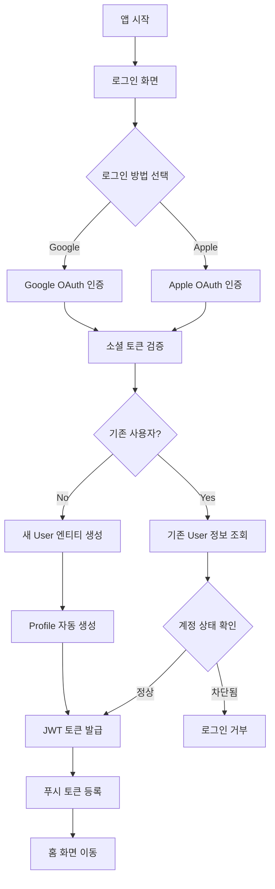

### 1.2 상세 단계

#### Step 1: 소셜 로그인 시작

```
POST /api/v1/auth/sign/social
{
  "provider": "google",
  "token": "social_auth_token",
  "pushToken": "fcm_token",
  "platform": "ios",
  "deviceId": "device_uuid"
}
```

#### Step 2: 사용자 생성 프로세스

1. **소셜 인증 토큰 검증**
   - Google/Apple 서버와 통신하여 토큰 유효성 확인
   - 사용자 정보 추출 (socialId, email, name)

2. **User 엔티티 생성**
   - socialId와 provider로 중복 확인
   - 새 사용자인 경우 User 레코드 생성
   - role: USER (기본값)
   - notificationsEnabled: true (기본값)

3. **Profile 자동 생성**
   - userId 연결
   - 기본값으로 빈 프로필 생성
   - 나중에 사용자가 직접 입력

#### Step 3: 토큰 발급 및 저장

```json
Response:
{
  "accessToken": "jwt_access_token",
  "refreshToken": "jwt_refresh_token",
  "isNewUser": true,
  "pushTokenRegistered": true
}
```

---

## 2. 기존 사용자 로그인 플로우

### 2.1 일반 사용자 로그인

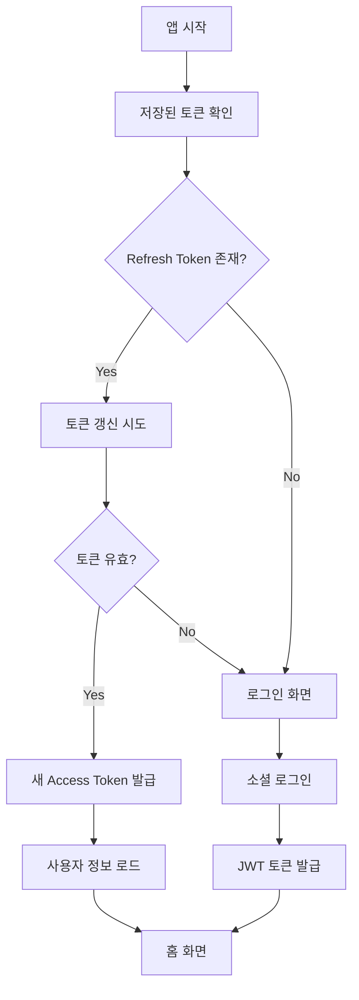

### 2.2 관리자 로그인

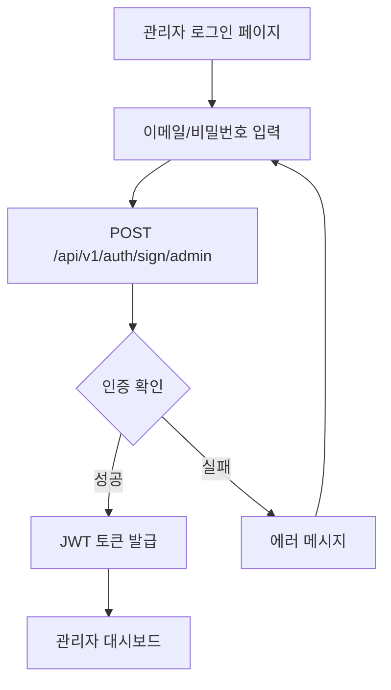

#### 관리자 인증 프로세스

```
POST /api/v1/auth/sign/admin
{
  "email": "admin@example.com",
  "password": "secure_password"
}
```

1. User 테이블에서 email과 role=ADMIN 확인
2. bcrypt로 비밀번호 검증 (12 salt rounds)
3. 계정 차단 상태 확인
4. JWT 토큰 발급

---

## 3. Travel 생성 및 참여 플로우

### 3.1 Travel 참여 (사용자)

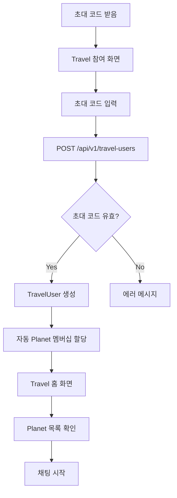

### 3.2 상세 프로세스

#### Step 1: 초대 코드 검증

```
POST /api/v1/travel-users
{
  "inviteCode": "TRAVEL2024"
}
```

#### Step 2: 멤버십 생성

1. **Travel 조회**
   - inviteCode로 Travel 찾기
   - 유효성 및 만료 확인

2. **TravelUser 생성**
   - role: PARTICIPANT
   - status: ACTIVE
   - joinedAt: 현재 시간

3. **Planet 자동 할당**
   - Travel의 모든 GROUP Planet에 자동 가입
   - PlanetUser 레코드 생성
   - notificationsEnabled: true (기본값)

#### Step 3: Travel 정보 로드

```
GET /api/v1/travels/{travelId}?include=travelUsers,planets
```

---

## 4. 채팅 플로우 (WebSocket Gateway)

### 4.1 메시지 전송 플로우 (Rate Limiting 포함)

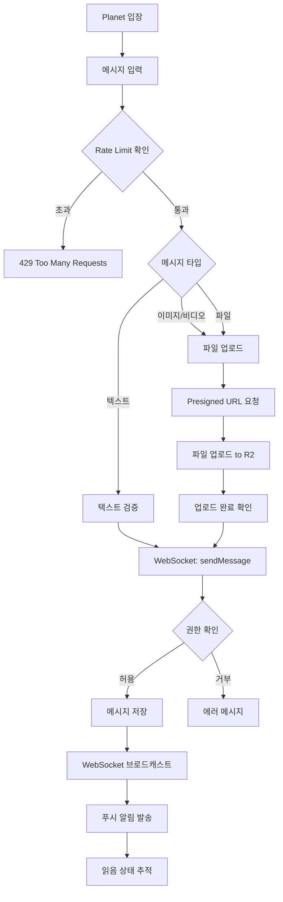

### 4.2 메시지 수신 플로우 (WebSocket Events)

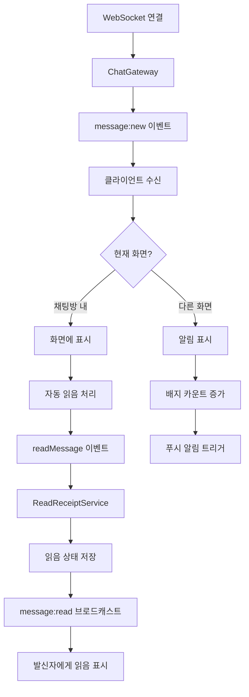

### 4.3 WebSocket 이벤트 목록

#### EnhancedWebSocketGateway 이벤트 (/chat namespace)
| 이벤트 명 | 방향 | 설명 | 인증 필요 |
|----------|------|------|----------|
| ping | C→S | 연결 상태 확인 | ✅ |
| join-room | C→S | 채팅방 참여 | ✅ |
| leave-room | C→S | 채팅방 퇴장 | ✅ |
| typing | C→S | 타이핑 상태 알림 | ✅ |
| pong | S→C | ping 응답 | - |
| connected | S→C | 연결 성공 | - |
| room-joined | S→C | 방 참여 완료 | - |
| room-left | S→C | 방 퇴장 완료 | - |
| user-joined | S→C | 다른 사용자 참여 | - |
| user-left | S→C | 다른 사용자 퇴장 | - |
| user-typing | S→C | 사용자 타이핑 중 | - |
| error | S→C | 에러 발생 | - |

#### ChatGateway 이벤트
| 이벤트 명 | 방향 | 설명 | Rate Limit |
|----------|------|------|------------|
| message:send | C→S | 메시지 전송 | 30/min |
| message:edit | C→S | 메시지 수정 | 10/min |
| message:delete | C→S | 메시지 삭제 | 10/min |
| message:restore | C→S | 메시지 복구 | 10/min |
| message:read | C→S | 메시지 읽음 | - |
| messages:read_multiple | C→S | 여러 메시지 읽음 | - |
| planet:read_all | C→S | Planet 전체 읽음 | - |
| planet:get_unread_count | C→S | 읽지 않은 메시지 수 조회 | - |
| user:get_all_unread_counts | C→S | 모든 Planet의 읽지 않은 수 | - |
| user:update_location | C→S | 위치 업데이트 | - |
| room:join | C→S | 채팅방 참여 | 10/min |
| room:leave | C→S | 채팅방 퇴장 | - |
| room:get_info | C→S | 채팅방 정보 조회 | - |
| typing:start | C→S | 타이핑 시작 | 10/10s |
| typing:stop | C→S | 타이핑 중지 | - |
| typing:advanced_start | C→S | 고급 타이핑 시작 | - |
| typing:advanced_stop | C→S | 고급 타이핑 중지 | - |
| typing:update | C→S | 타이핑 상태 업데이트 | - |
| typing:get_status | C→S | 타이핑 상태 조회 | - |
| typing:get_users | C→S | 타이핑 사용자 목록 | - |
| typing:get_analytics | C→S | 타이핑 분석 데이터 | - |
| notifications:subscribe | C→S | 알림 구독 | - |
| notifications:unsubscribe | C→S | 알림 구독 해제 | - |
| notifications:update_status | C→S | 알림 상태 업데이트 | - |
| notifications:get_list | C→S | 알림 목록 조회 | - |

*C→S: Client to Server, S→C: Server to Client*

### 4.4 상세 단계

#### 텍스트 메시지 전송 (WebSocket)

```javascript
// WebSocket 이벤트
socket.emit('sendMessage', {
  type: 'TEXT',
  planetId: 123,
  content: '안녕하세요!',
  replyToMessageId: null
});

// 서버 응답
socket.on('message:new', (data) => {
  console.log('새 메시지:', data);
});
```

#### 이미지 메시지 전송

```
Step 1: Presigned URL 획득
POST /api/v1/file-uploads/presigned-url
{
  "fileName": "photo.jpg",
  "fileSize": 2048000,
  "mimeType": "image/jpeg",
  "folder": "messages"
}

Step 2: 파일 업로드 (Client → Cloudflare R2)
PUT {presignedUrl}
Body: Binary Image Data

Step 3: 업로드 완료 확인
POST /api/v1/file-uploads/complete
{
  "uploadId": 456,
  "storageKey": "messages/2024/photo.jpg"
}

Step 4: 메시지 생성
POST /api/v1/messages
{
  "type": "IMAGE",
  "planetId": 123,
  "content": "",
  "fileMetadata": {
    "uploadId": 456,
    "url": "https://cdn.example.com/messages/2024/photo.jpg",
    "size": 2048000,
    "mimeType": "image/jpeg"
  }
}
```

---

## 5. 파일 공유 플로우

### 5.1 대용량 파일 업로드 (청크 업로드)

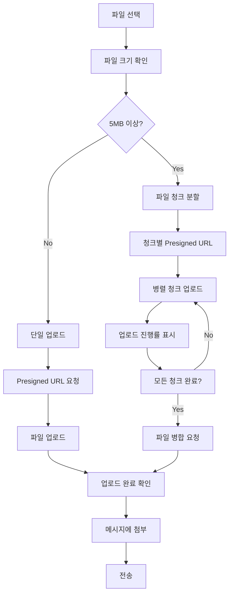

### 5.2 비디오 스트리밍

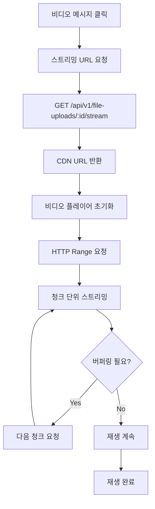

---

## 6. 알림 관리 플로우

### 6.1 푸시 알림 수신 플로우 (Multi-Channel Support)

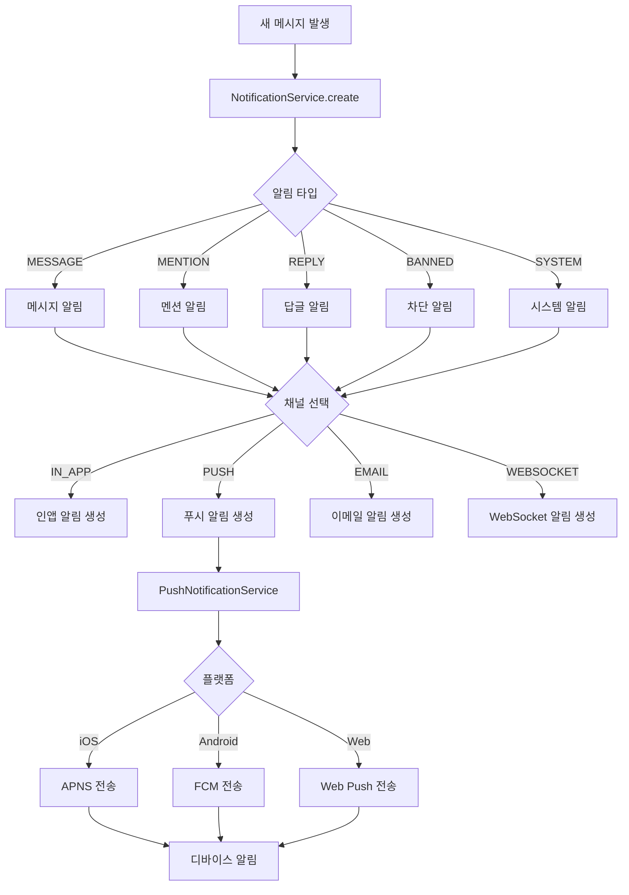

### 6.2 푸시 토큰 관리 플로우

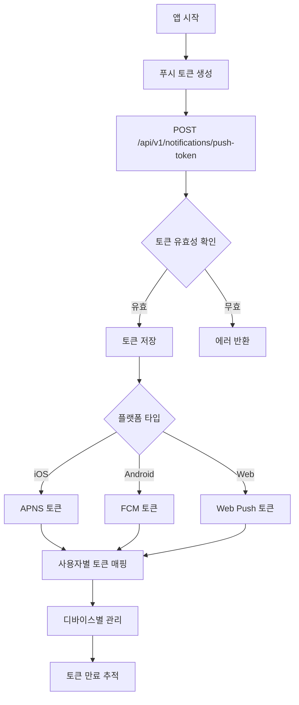

### 6.3 알림 설정 관리

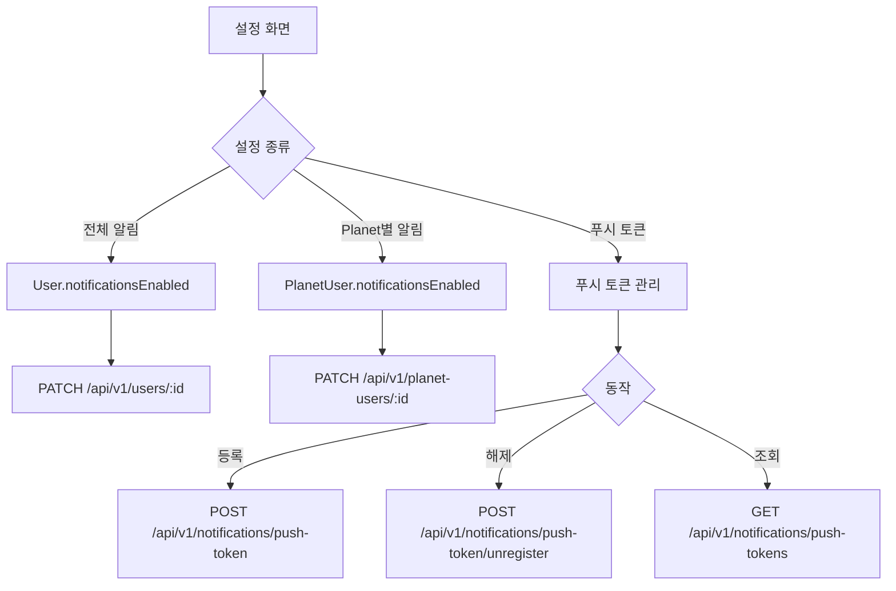

---

## 7. 프로필 관리 플로우

### 7.1 프로필 수정

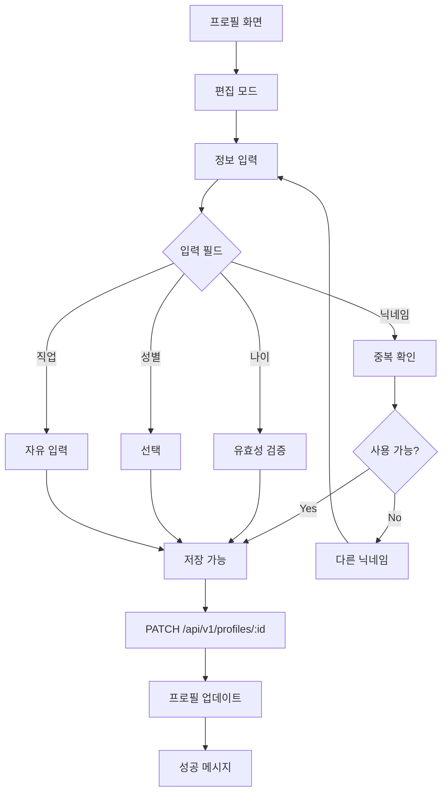

### 7.2 프로필 조회

```
GET /api/v1/profiles/{userId}?include=user
```

응답:

```json
{
  "data": {
    "id": 1,
    "userId": 123,
    "nickname": "여행자",
    "name": "홍길동",
    "gender": "MALE",
    "age": 25,
    "occupation": "개발자",
    "user": {
      "id": 123,
      "name": "홍길동",
      "email": "user@example.com"
    }
  }
}
```

---

## 8. 사용자 차단/신고 플로우 (Moderation)

### 8.1 Travel 레벨 차단 (HOST/ADMIN 권한)

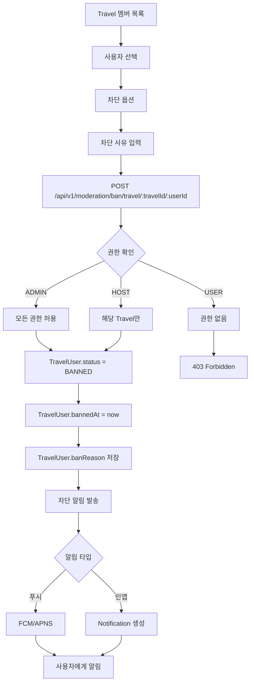

### 8.2 플랫폼 레벨 차단 (ADMIN 전용)

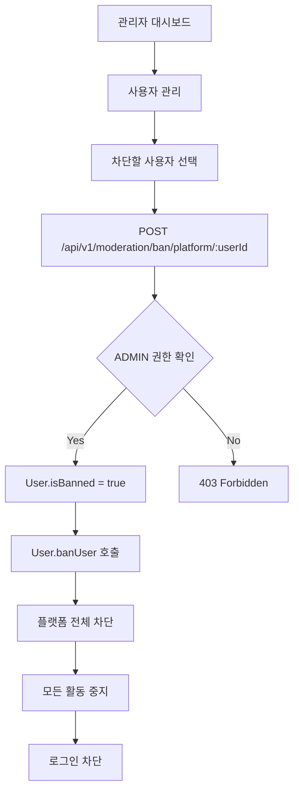

### 8.3 Planet 레벨 뮤트 (MUTE 기능)

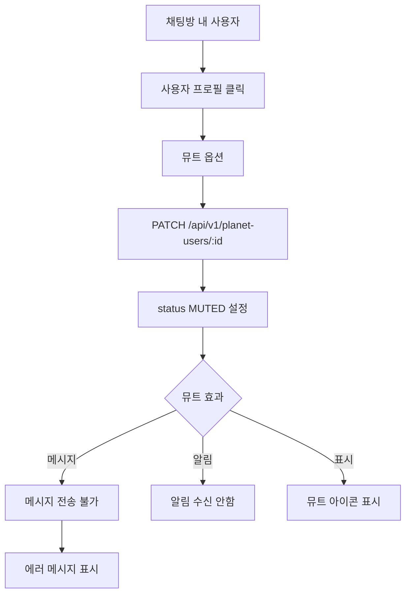

### 8.4 시스템 레벨 차단 및 강제 로그아웃 (ADMIN 권한)

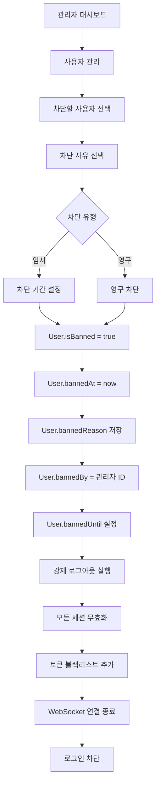

---

## 9. 강제 로그아웃 플로우

### 9.1 관리자에 의한 강제 로그아웃

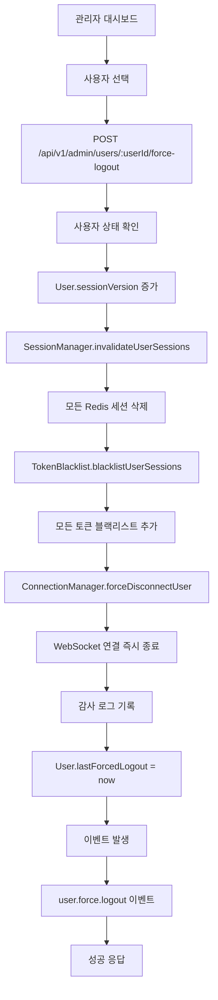

### 9.2 강제 로그아웃 후 사용자 경험

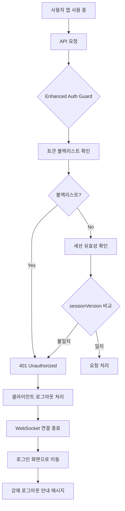

### 9.3 세션 모니터링 및 관리

```
GET /api/v1/admin/users/:userId/sessions
```

응답:
```json
{
  "sessions": [
    {
      "sessionId": "uuid-1234",
      "deviceId": "iPhone-XYZ",
      "platform": "ios",
      "ipAddress": "192.168.1.1",
      "userAgent": "MyApp/1.0",
      "createdAt": "2025-01-15T10:00:00Z",
      "lastActivity": "2025-01-15T15:30:00Z"
    }
  ],
  "totalCount": 3
}
```

---

## 10. 세션 관리 플로우

### 10.1 세션 생성 및 추적

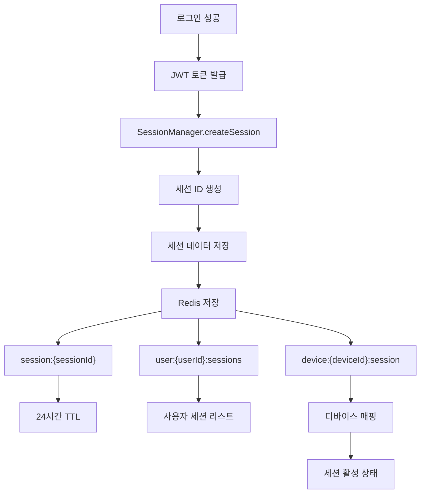

### 10.2 토큰 블랙리스트 플로우

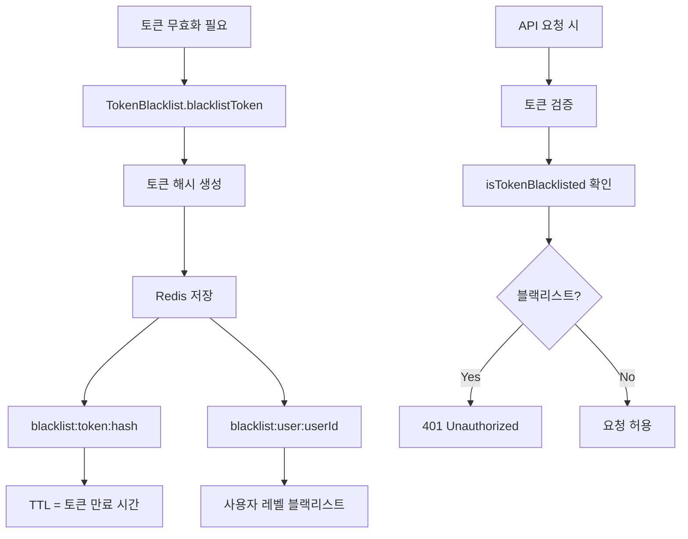

### 10.3 WebSocket 연결 관리 (Dual Gateway System)

#### EnhancedWebSocketGateway (인증 및 연결 관리)
```mermaid
graph TD
    A[WebSocket 연결 요청] --> B[토큰 추출]
    B --> C{토큰 있음?}
    
    C -->|No| D[연결 거부]
    C -->|Yes| E[TokenBlacklist 확인]
    
    E --> F{블랙리스트?}
    F -->|Yes| G[연결 거부 + 에러 메시지]
    F -->|No| H[JWT 검증]
    
    H --> I{유효한 토큰?}
    I -->|No| J[401 Unauthorized]
    I -->|Yes| K[사용자 조회]
    
    K --> L{차단된 사용자?}
    L -->|Yes| M[연결 거부]
    L -->|No| N[ConnectionManager.registerConnection]
    
    N --> O[연결 등록]
    O --> P[Heartbeat 설정 (25초)]
```

#### ChatGateway (채팅 기능)
```mermaid
graph TD
    A[인증된 연결] --> B[채팅 이벤트 수신]
    B --> C{Rate Limit 확인}
    
    C -->|초과| D[Rate Limit 에러]
    C -->|통과| E{이벤트 타입}
    
    E -->|joinRoom| F[Room 참여]
    E -->|sendMessage| G[메시지 전송]
    E -->|typing| H[타이핑 표시]
    E -->|readMessage| I[읽음 처리]
    
    F --> J[WebSocketRoomService]
    G --> K[WebSocketBroadcastService]
    H --> L[TypingIndicatorService]
    I --> M[ReadReceiptService]
```

---

## 11. 실시간 상태 관리 플로우

### 11.1 온라인 상태 추적 (WebSocketRoomService)

```mermaid
graph TD
    A[WebSocket 연결] --> B[EnhancedWebSocketGateway]
    B --> C[사용자 인증]
    
    C --> D[ConnectionManager.registerConnection]
    D --> E[온라인 상태 업데이트]
    
    E --> F[WebSocketRoomService]
    F --> G[Redis 저장]
    
    G --> H[상태 브로드캐스트]
    H --> I{user:online 이벤트}
    
    I -->|같은 Planet| J[온라인 표시]
    I -->|친구 목록| K[온라인 표시]
    
    L[WebSocket 종료] --> M[handleDisconnect]
    M --> N[오프라인 상태]
    
    N --> O[Redis 삭제]
    O --> P[user:offline 브로드캐스트]
```

### 11.2 타이핑 인디케이터 (TypingIndicatorService)

```mermaid
graph TD
    A[텍스트 입력 시작] --> B[typing 이벤트]
    B --> C{Rate Limit 확인}
    
    C -->|초과| D[무시]
    C -->|통과| E[TypingIndicatorService]
    
    E --> F[타이핑 상태 저장]
    F --> G[같은 Planet 사용자에게 브로드캐스트]
    
    G --> H[타이핑 표시]
    H --> I[3초 타이머 시작]
    
    I --> J{계속 타이핑?}
    J -->|Yes| K[타이머 리셋]
    J -->|No| L[타이핑 표시 제거]
    
    K --> I
```

---

## 12. 에러 처리 플로우

### 12.1 API 에러 처리

```mermaid
graph TD
    A[API 요청] --> B{응답 상태}

    B -->|200-299| C[성공 처리]
    B -->|401| D[토큰 갱신 시도]
    B -->|403| E[권한 없음 알림]
    B -->|404| F[리소스 없음]
    B -->|500+| G[서버 에러]

    D --> H{갱신 성공?}
    H -->|Yes| I[요청 재시도]
    H -->|No| J[로그인 화면]

    E --> K[에러 메시지 표시]
    F --> K
    G --> L[재시도 or 지원팀 안내]
```

### 12.2 네트워크 에러 처리

```mermaid
graph TD
    A[네트워크 요청] --> B{연결 상태}

    B -->|연결됨| C[정상 처리]
    B -->|연결 끊김| D[오프라인 모드]

    D --> E[로컬 캐시 사용]
    E --> F[큐에 요청 저장]

    G[연결 복구] --> H[큐 처리]
    H --> I[동기화]
    I --> J[최신 상태 반영]
```

---

## 13. 성능 최적화 플로우

### 13.1 메시지 페이지네이션

```mermaid
graph TD
    A[채팅방 입장] --> B[최근 50개 메시지 로드]
    B --> C[화면 표시]

    D[스크롤 위로] --> E{더 로드?}
    E -->|Yes| F[이전 50개 요청]
    E -->|No| G[대기]

    F --> H[커서 기반 페이지네이션]
    H --> I[메시지 추가]
    I --> J[스크롤 위치 유지]
```

### 13.2 이미지 최적화

```mermaid
graph TD
    A[이미지 업로드] --> B{파일 크기}

    B -->|<5MB| C[원본 업로드]
    B -->|>=5MB| D[자동 리사이징]

    D --> E[최대 1920x1080]
    E --> F[WebP 변환]
    F --> G[품질 85%]

    C --> H[CDN 업로드]
    G --> H

    H --> I[썸네일 생성]
    I --> J[다양한 크기 버전]
    J --> K[디바이스별 최적화]
```

---

## 14. 보안 플로우

### 14.1 JWT 토큰 관리

```mermaid
graph TD
    A[로그인 성공] --> B[토큰 발급]
    B --> C{토큰 종류}

    C -->|Access Token| D[메모리 저장]
    C -->|Refresh Token| E[Secure Storage]

    D --> F[15분 유효]
    E --> G[7일 유효]

    F --> H{만료?}
    H -->|Yes| I[Refresh 요청]
    H -->|No| J[API 요청]

    I --> K[새 Access Token]
    K --> J
```

### 14.2 데이터 암호화

```mermaid
graph TD
    A[민감한 데이터] --> B{데이터 유형}

    B -->|비밀번호| C[bcrypt 해싱]
    B -->|개인정보| D[AES 암호화]
    B -->|토큰| E[JWT 서명]

    C --> F[Salt rounds: 12]
    D --> G[256-bit 키]
    E --> H[RS256 알고리즘]

    F --> I[DB 저장]
    G --> I
    H --> J[전송]
```

---

## 15. WebSocket 서비스 아키텍처

### 15.1 WebSocket 서비스 계층 구조

```mermaid
graph TD
    A[Client] --> B[WebSocket Connection]
    B --> C{Gateway Type}
    
    C -->|Auth/Connection| D[EnhancedWebSocketGateway]
    C -->|Chat/Messaging| E[ChatGateway]
    
    D --> F[ConnectionManagerService]
    D --> G[TokenBlacklistService]
    D --> H[SessionManagerService]
    
    E --> I[WebSocketRoomService]
    E --> J[WebSocketBroadcastService]
    E --> K[TypingIndicatorService]
    E --> L[RateLimitService]
    
    I --> M[Redis Pub/Sub]
    J --> M
    K --> M
    
    M --> N[실시간 동기화]
```

### 15.2 WebSocket 서비스 역할

| 서비스 | 역할 | 주요 기능 |
|---------|------|----------|
| ConnectionManagerService | 연결 관리 | 사용자/디바이스별 연결 추적, 강제 연결 종료 |
| WebSocketRoomService | 방 관리 | 채팅방 참여/퇴장, 온라인 상태 |
| WebSocketBroadcastService | 메시지 브로드캐스트 | 방/사용자별 메시지 전송 |
| TypingIndicatorService | 타이핑 표시 | 타이핑 상태 관리 및 전파 |
| RateLimitService | 속도 제한 | 액션별 Rate Limiting |
| TokenBlacklistService | 토큰 블랙리스트 | 무효화된 토큰 관리, 강제 로그아웃 지원 |
| SessionManagerService | 세션 관리 | 사용자 세션 추적, TTL 관리 |

### 15.3 기타 핵심 서비스

| 서비스 | 모듈 | 역할 | 주요 기능 |
|---------|------|------|----------|
| StorageService | storage | 파일 저장소 | Cloudflare R2 통합, 파일 업로드/다운로드 |
| RedisService | cache | 캐싱 | Redis 기반 캐싱, Pub/Sub |
| PushNotificationService | notification | 푸시 알림 | FCM 기반 푸시 알림 전송 |
| MessagePaginationService | message | 메시지 페이징 | 커서 기반 페이지네이션 |
| CrudMetadataService | schema | CRUD 메타데이터 | 엔티티 CRUD 설정 관리 |
| SecurityValidationService | schema | 보안 검증 | 엔티티 보안 규칙 검증 |
| SchedulerService | scheduler | 스케줄링 | 배치 작업, 정기 작업 관리 |

---

## 16. Moderation 플로우 (권한 기반 벤 시스템)

### 16.1 벤 권한 계층 구조

```mermaid
graph TD
    A[사용자 역할] --> B{역할 확인}
    
    B -->|ADMIN| C[모든 레벨 벤 가능]
    B -->|HOST| D[자신의 Travel만]
    B -->|USER| E[벤 권한 없음]
    
    C --> F[플랫폼 벤]
    C --> G[Travel 벤]
    C --> H[Planet 뮤트]
    
    D --> I[Travel 벤 (자신이 HOST인 경우)]
    D --> J[Planet 뮤트 (자신의 Travel 내)]
    
    E --> K[권한 없음 에러]
```

### 16.2 벤 해제 플로우

```mermaid
graph TD
    A[벤 해제 요청] --> B{레벨 확인}
    
    B -->|플랫폼| C[POST /api/v1/moderation/unban/platform/:userId]
    B -->|Travel| D[POST /api/v1/moderation/unban/travel/:travelId/:userId]
    
    C --> E{ADMIN 권한?}
    E -->|Yes| F[User.unbanUser]
    E -->|No| G[403 Forbidden]
    
    D --> H{권한 확인}
    H -->|ADMIN| I[TravelUser.unbanUser]
    H -->|HOST| J{자신의 Travel?}
    H -->|USER| K[403 Forbidden]
    
    J -->|Yes| I
    J -->|No| K
    
    F --> L[벤 해제 완료]
    I --> L
```

---

## 17. Rate Limiting 시스템

### 17.1 WebSocket Rate Limiting

```mermaid
graph TD
    A[WebSocket 이벤트] --> B[RateLimitService]
    B --> C{액션 타입}
    
    C -->|메시지 전송| D[MessageSendRateLimit]
    C -->|파일 업로드| E[FileUploadRateLimit]
    C -->|방 참여| F[RoomJoinRateLimit]
    C -->|타이핑| G[TypingRateLimit]
    
    D --> H{제한 확인}
    E --> H
    F --> H
    G --> H
    
    H -->|초과| I[429 에러 + 남은 시간]
    H -->|통과| J[액션 실행]
    
    I --> K[클라이언트에 에러 전송]
    J --> L[정상 처리]
```

### 17.2 Rate Limit 설정

| 액션 | 제한 | 시간 창 | 설명 |
|------|------|---------|------|
| 메시지 전송 | 30개 | 60초 | 분당 30개 메시지 |
| 파일 업로드 | 10개 | 60초 | 분당 10개 파일 |
| 방 참여 | 10개 | 60초 | 분당 10개 방 참여 |
| 타이핑 표시 | 10개 | 10초 | 10초당 10회 |

---

## 📝 플로우 다이어그램 범례

- **사각형**: 프로세스 또는 액션
- **다이아몬드**: 결정 포인트
- **원**: 시작/종료 포인트
- **화살표**: 플로우 방향
- **점선**: 선택적 경로
- **실선**: 필수 경로

---

## 🔗 관련 문서

- [API Routes Documentation](./routes.md)
- [Entity Relationship Diagram](./entity-relationship-diagram.md)
- [Database Schema](./schema.md)
- [WebSocket Events](./websocket.md)
- [Error Codes](./errors.md)
- [Project Index](../PROJECT_INDEX.md)
- [CLAUDE.md](../CLAUDE.md)
