# User Flow Documentation

이 문서는 Connecto 애플리케이션의 주요 사용자 플로우를 상세히 설명합니다.

## 📋 목차

1. [신규 사용자 온보딩 플로우](#1-신규-사용자-온보딩-플로우)
2. [기존 사용자 로그인 플로우](#2-기존-사용자-로그인-플로우)
3. [Travel 생성 및 참여 플로우](#3-travel-생성-및-참여-플로우)
4. [채팅 플로우](#4-채팅-플로우)
5. [파일 공유 플로우](#5-파일-공유-플로우)
6. [알림 관리 플로우](#6-알림-관리-플로우)
7. [프로필 관리 플로우](#7-프로필-관리-플로우)
8. [사용자 차단/신고 플로우](#8-사용자-차단신고-플로우)

---

## 1. 신규 사용자 온보딩 플로우

### 1.1 소셜 로그인을 통한 회원가입

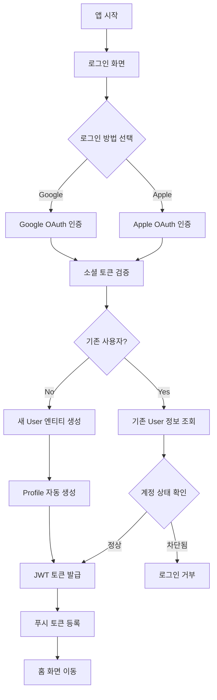

### 1.2 상세 단계

#### Step 1: 소셜 로그인 시작

```
POST /api/v1/auth/sign/social
{
  "provider": "google",
  "token": "social_auth_token",
  "pushToken": "fcm_token",
  "platform": "ios",
  "deviceId": "device_uuid"
}
```

#### Step 2: 사용자 생성 프로세스

1. **소셜 인증 토큰 검증**
   - Google/Apple 서버와 통신하여 토큰 유효성 확인
   - 사용자 정보 추출 (socialId, email, name)

2. **User 엔티티 생성**
   - socialId와 provider로 중복 확인
   - 새 사용자인 경우 User 레코드 생성
   - role: USER (기본값)
   - notificationsEnabled: true (기본값)

3. **Profile 자동 생성**
   - userId 연결
   - 기본값으로 빈 프로필 생성
   - 나중에 사용자가 직접 입력

#### Step 3: 토큰 발급 및 저장

```json
Response:
{
  "accessToken": "jwt_access_token",
  "refreshToken": "jwt_refresh_token",
  "isNewUser": true,
  "pushTokenRegistered": true
}
```

---

## 2. 기존 사용자 로그인 플로우

### 2.1 일반 사용자 로그인

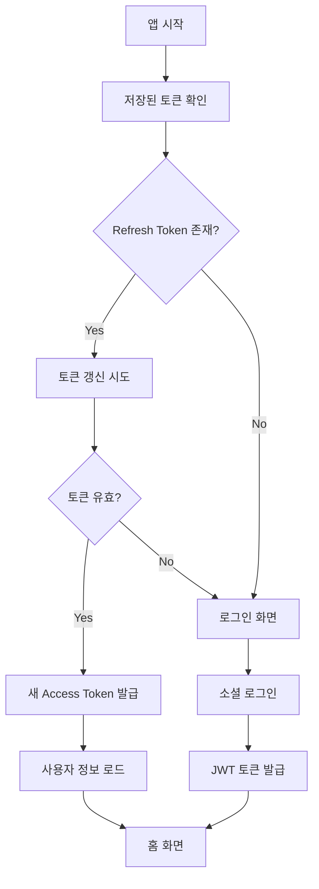

### 2.2 관리자 로그인

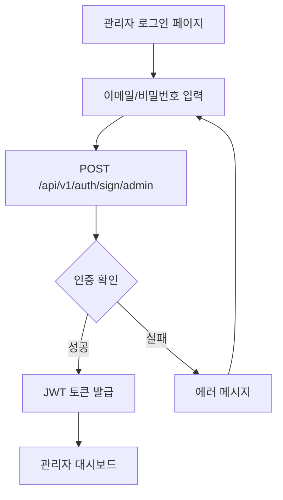

#### 관리자 인증 프로세스

```
POST /api/v1/auth/sign/admin
{
  "email": "admin@example.com",
  "password": "secure_password"
}
```

1. User 테이블에서 email과 role=ADMIN 확인
2. bcrypt로 비밀번호 검증 (12 salt rounds)
3. 계정 차단 상태 확인
4. JWT 토큰 발급

---

## 3. Travel 생성 및 참여 플로우

### 3.1 Travel 참여 (사용자)

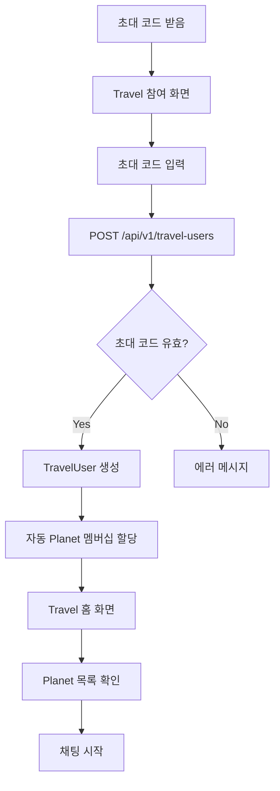

### 3.2 상세 프로세스

#### Step 1: 초대 코드 검증

```
POST /api/v1/travel-users
{
  "inviteCode": "TRAVEL2024"
}
```

#### Step 2: 멤버십 생성

1. **Travel 조회**
   - inviteCode로 Travel 찾기
   - 유효성 및 만료 확인

2. **TravelUser 생성**
   - role: PARTICIPANT
   - status: ACTIVE
   - joinedAt: 현재 시간

3. **Planet 자동 할당**
   - Travel의 모든 GROUP Planet에 자동 가입
   - PlanetUser 레코드 생성
   - notificationsEnabled: true (기본값)

#### Step 3: Travel 정보 로드

```
GET /api/v1/travels/{travelId}?include=travelUsers,planets
```

---

## 4. 채팅 플로우

### 4.1 메시지 전송 플로우

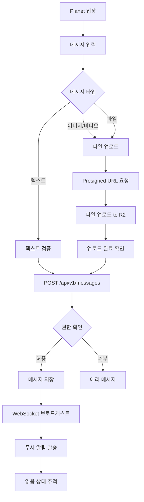

### 4.2 메시지 수신 플로우

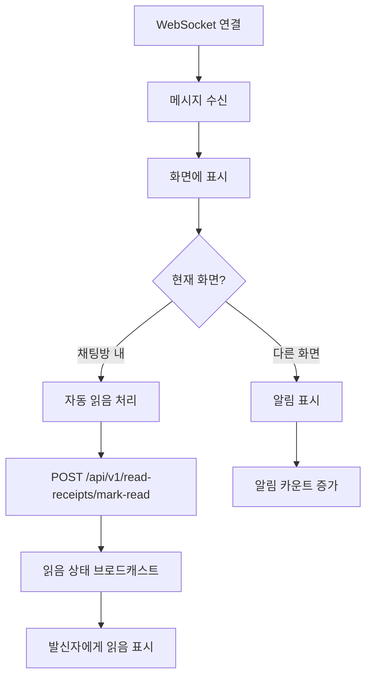

### 4.3 상세 단계

#### 텍스트 메시지 전송

```
POST /api/v1/messages
{
  "type": "TEXT",
  "planetId": 123,
  "content": "안녕하세요!",
  "replyToMessageId": null
}
```

#### 이미지 메시지 전송

```
Step 1: Presigned URL 획득
POST /api/v1/file-uploads/presigned-url
{
  "fileName": "photo.jpg",
  "fileSize": 2048000,
  "mimeType": "image/jpeg",
  "folder": "messages"
}

Step 2: 파일 업로드 (Client → Cloudflare R2)
PUT {presignedUrl}
Body: Binary Image Data

Step 3: 업로드 완료 확인
POST /api/v1/file-uploads/complete
{
  "uploadId": 456,
  "storageKey": "messages/2024/photo.jpg"
}

Step 4: 메시지 생성
POST /api/v1/messages
{
  "type": "IMAGE",
  "planetId": 123,
  "content": "",
  "fileMetadata": {
    "uploadId": 456,
    "url": "https://cdn.example.com/messages/2024/photo.jpg",
    "size": 2048000,
    "mimeType": "image/jpeg"
  }
}
```

---

## 5. 파일 공유 플로우

### 5.1 대용량 파일 업로드 (청크 업로드)

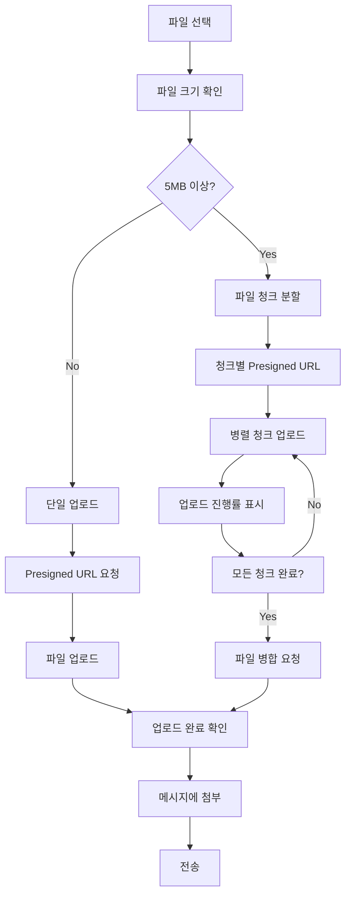

### 5.2 비디오 스트리밍

```mermaid
graph TD
    A[비디오 메시지 클릭] --> B[스트리밍 URL 요청]
    B --> C[GET /api/v1/file-uploads/{id}/stream]

    C --> D[CDN URL 반환]
    D --> E[비디오 플레이어 초기화]

    E --> F[HTTP Range 요청]
    F --> G[청크 단위 스트리밍]

    G --> H{버퍼링 필요?}
    H -->|Yes| I[다음 청크 요청]
    H -->|No| J[재생 계속]

    I --> G
    J --> K[재생 완료]
```

---

## 6. 알림 관리 플로우

### 6.1 푸시 알림 수신 플로우

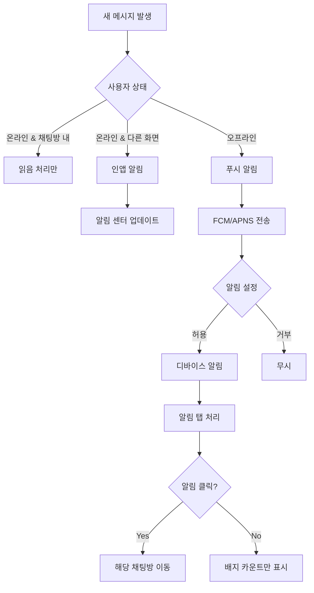

### 6.2 알림 설정 관리

```mermaid
graph TD
    A[설정 화면] --> B{설정 종류}

    B -->|전체 알림| C[User.notificationsEnabled]
    B -->|Planet별 알림| D[PlanetUser.notificationsEnabled]
    B -->|푸시 토큰| E[푸시 토큰 관리]

    C --> F[PATCH /api/v1/users/{id}]
    D --> G[PATCH /api/v1/planet-users/{id}]
    E --> H{동작}

    H -->|등록| I[POST /api/v1/notifications/push-token]
    H -->|해제| J[POST /api/v1/notifications/push-token/unregister]
    H -->|조회| K[GET /api/v1/notifications/push-tokens]
```

---

## 7. 프로필 관리 플로우

### 7.1 프로필 수정

```mermaid
graph TD
    A[프로필 화면] --> B[편집 모드]
    B --> C[정보 입력]

    C --> D{입력 필드}
    D -->|닉네임| E[중복 확인]
    D -->|나이| F[유효성 검증]
    D -->|성별| G[선택]
    D -->|직업| H[자유 입력]

    E --> I{사용 가능?}
    I -->|Yes| J[저장 가능]
    I -->|No| K[다른 닉네임]

    F --> J
    G --> J
    H --> J
    K --> C

    J --> L[PATCH /api/v1/profiles/{id}]
    L --> M[프로필 업데이트]
    M --> N[성공 메시지]
```

### 7.2 프로필 조회

```
GET /api/v1/profiles/{userId}?include=user
```

응답:

```json
{
  "data": {
    "id": 1,
    "userId": 123,
    "nickname": "여행자",
    "name": "홍길동",
    "gender": "MALE",
    "age": 25,
    "occupation": "개발자",
    "user": {
      "id": 123,
      "name": "홍길동",
      "email": "user@example.com"
    }
  }
}
```

---

## 8. 사용자 차단/신고 플로우

### 8.1 Travel 레벨 차단 (HOST 권한)

```mermaid
graph TD
    A[Travel 멤버 목록] --> B[사용자 선택]
    B --> C[차단 옵션]

    C --> D[차단 사유 입력]
    D --> E[PATCH /api/v1/travel-users/{id}]

    E --> F[status: BANNED 설정]
    F --> G[모든 Planet에서 자동 제거]

    G --> H[차단 알림 발송]
    H --> I{알림 타입}

    I -->|푸시| J[FCM/APNS]
    I -->|인앱| K[Notification 생성]

    J --> L[사용자에게 알림]
    K --> L
```

### 8.2 Planet 레벨 뮤트 (MUTE 기능)

```mermaid
graph TD
    A[채팅방 내 사용자] --> B[사용자 프로필 클릭]
    B --> C[뮤트 옵션]

    C --> D[PATCH /api/v1/planet-users/{id}]
    D --> E[status: MUTED 설정]

    E --> F{뮤트 효과}
    F -->|메시지| G[메시지 전송 불가]
    F -->|알림| H[알림 수신 안함]
    F -->|표시| I[뮤트 아이콘 표시]

    G --> J[에러 메시지 표시]
```

### 8.3 시스템 레벨 차단 (ADMIN 권한)

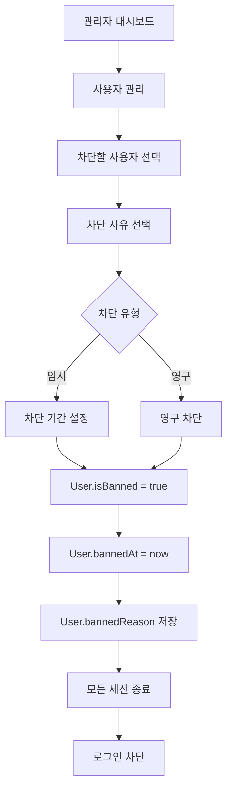

---

## 9. 실시간 상태 관리 플로우

### 9.1 온라인 상태 추적

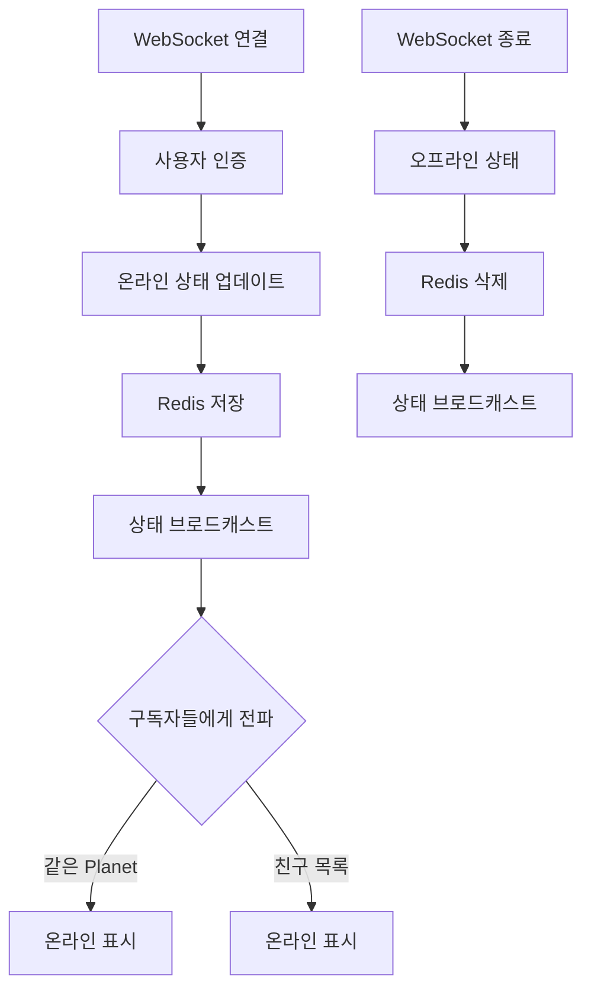

### 9.2 타이핑 인디케이터

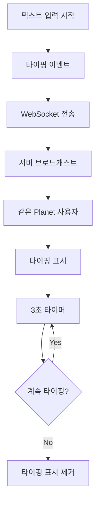

---

## 10. 에러 처리 플로우

### 10.1 API 에러 처리

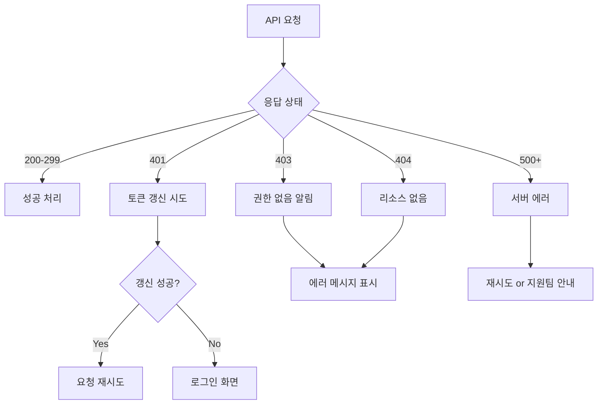

### 10.2 네트워크 에러 처리

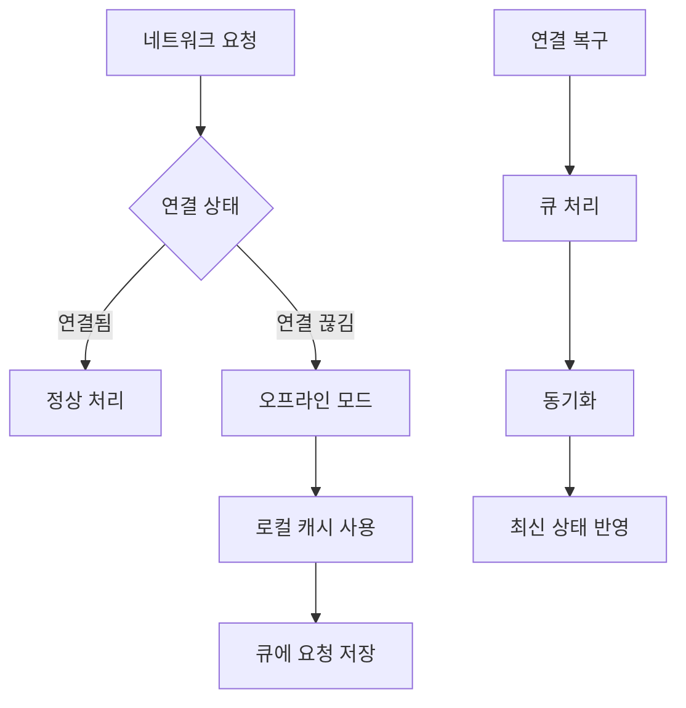

---

## 11. 성능 최적화 플로우

### 11.1 메시지 페이지네이션

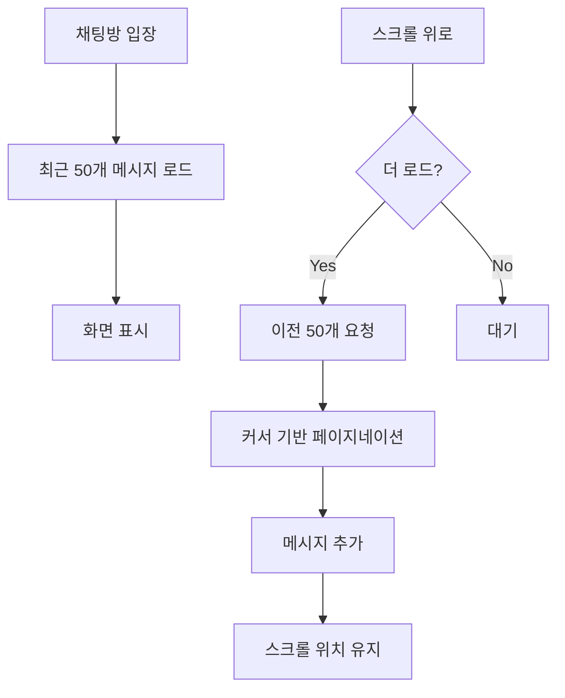

### 11.2 이미지 최적화

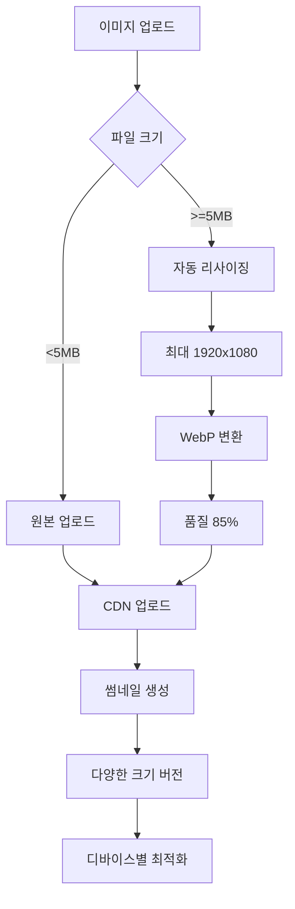

---

## 12. 보안 플로우

### 12.1 JWT 토큰 관리

```mermaid
graph TD
    A[로그인 성공] --> B[토큰 발급]
    B --> C{토큰 종류}

    C -->|Access Token| D[메모리 저장]
    C -->|Refresh Token| E[Secure Storage]

    D --> F[15분 유효]
    E --> G[7일 유효]

    F --> H{만료?}
    H -->|Yes| I[Refresh 요청]
    H -->|No| J[API 요청]

    I --> K[새 Access Token]
    K --> J
```

### 12.2 데이터 암호화

```mermaid
graph TD
    A[민감한 데이터] --> B{데이터 유형}

    B -->|비밀번호| C[bcrypt 해싱]
    B -->|개인정보| D[AES 암호화]
    B -->|토큰| E[JWT 서명]

    C --> F[Salt rounds: 12]
    D --> G[256-bit 키]
    E --> H[RS256 알고리즘]

    F --> I[DB 저장]
    G --> I
    H --> J[전송]
```

---

## 📝 플로우 다이어그램 범례

- **사각형**: 프로세스 또는 액션
- **다이아몬드**: 결정 포인트
- **원**: 시작/종료 포인트
- **화살표**: 플로우 방향
- **점선**: 선택적 경로
- **실선**: 필수 경로

---

## 🔗 관련 문서

- [API Routes Documentation](./routes.md)
- [Database Schema](./schema.md)
- [WebSocket Events](./websocket.md)
- [Error Codes](./errors.md)
